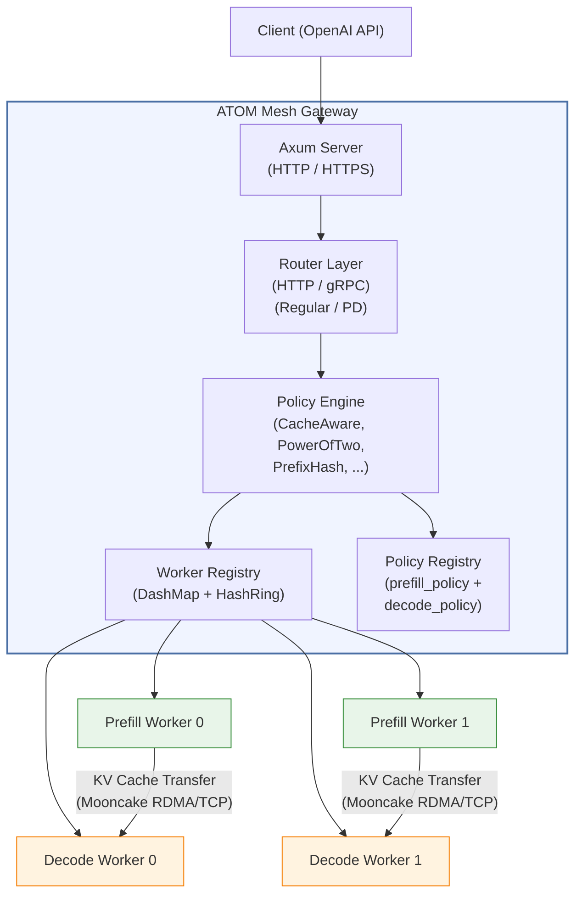
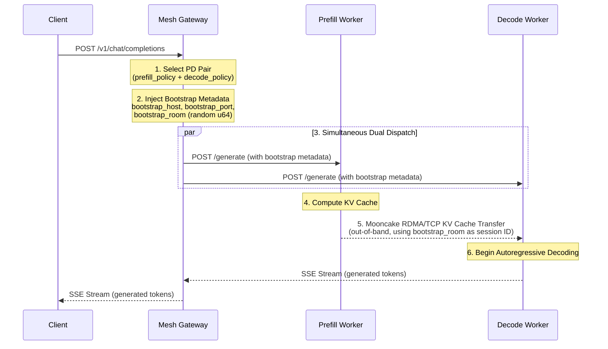
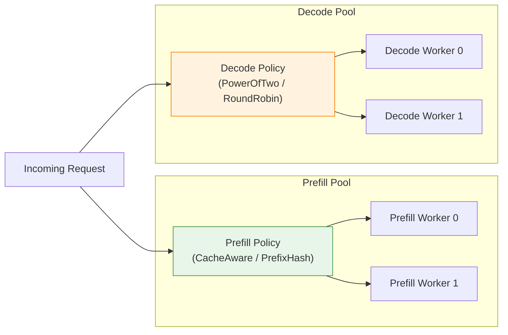
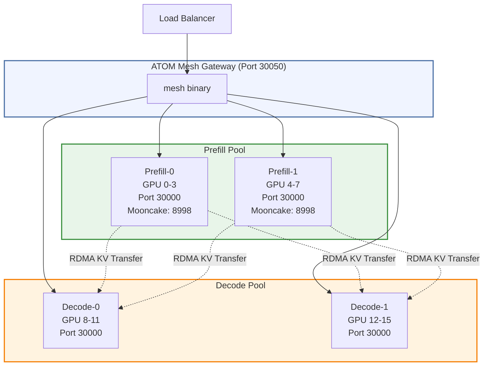

# RFC: ATOM Mesh — High-Performance Model Gateway for Prefill-Decode Disaggregation

**Status:** Draft
**Authors:** ATOM Team
**Date:** 2026-04-08

---

## 1. Summary

ATOM Mesh is a high-performance model routing gateway written in Rust, purpose-built for **Prefill-Decode (PD) disaggregated LLM inference** on the AMD ROCm platform. It serves as both the control plane and data plane for orchestrating fleets of heterogeneous LLM workers, enabling independent scaling and optimized GPU utilization for the prefill and decode phases of autoregressive inference.

Forked from [sgl-model-gateway v0.3.2](https://github.com/sgl-project/sglang/tree/main/sgl-model-gateway) and extended with PD-specific routing, gRPC pipeline support, cache-aware load balancing, and out-of-band KV cache transfer coordination via the Mooncake Transfer Engine.

---

## 2. Motivation

LLM inference has two phases with opposite compute profiles: **prefill** is compute-bound (parallel matrix ops), while **decode** is memory-bandwidth-bound (sequential token generation). Coupling them on the same GPU wastes resources — prefill bursts starve decode, and decode underutilizes ALUs.

ATOM Mesh solves this by separating them into **independent worker pools** that scale and optimize independently, with KV cache transferred between pools via RDMA/TCP (Mooncake). This is the AMD ROCm counterpart to NVIDIA Dynamo's PD disaggregation.

---

## 3. Architecture Overview



### Component Summary

| Component | Role |
|-----------|------|
| **Axum Server** | HTTP/HTTPS entry point, OpenAI-compatible API endpoints |
| **Router Layer** | HTTP and gRPC routers for Regular and PD modes |
| **Policy Engine** | Load balancing algorithms (CacheAware, PowerOfTwo, PrefixHash, etc.) |
| **Worker Registry** | Live worker state, health tracking, consistent hash ring |
| **Policy Registry** | Model-to-policy mappings; separate prefill/decode policy slots |
| **Circuit Breaker** | Per-worker failure detection with automatic recovery |
| **Retry Executor** | Exponential backoff retry with worker re-selection |
| **Service Discovery** | Kubernetes pod watcher for dynamic worker registration |
| **Observability** | Prometheus metrics, OpenTelemetry tracing, structured logging |

---

## 4. PD Disaggregation Design

### 4.1 Routing Mode Configuration

The gateway supports two routing modes:

```rust
pub enum RoutingMode {
    // All workers are equivalent
    Regular { worker_urls: Vec<String> },

    // Separate prefill and decode worker pools
    PrefillDecode {
        prefill_urls: Vec<(String, Option<u16>)>,  // URL + optional bootstrap port
        decode_urls: Vec<String>,
        prefill_policy: Option<PolicyConfig>,       // Independent policy for prefill
        decode_policy: Option<PolicyConfig>,         // Independent policy for decode
    },
}
```

CLI usage:

```bash
mesh --pd-disaggregation \
    --prefill http://prefill-0:30000 8998 \
    --prefill http://prefill-1:30000 8998 \
    --decode  http://decode-0:30000 \
    --decode  http://decode-1:30000 \
    --prefill-policy cache_aware \
    --decode-policy  power_of_two
```

### 4.2 Request Lifecycle in PD Mode



**Step-by-step:**

1. **Worker Pair Selection** — The prefill policy selects a prefill worker, and the decode policy independently selects a decode worker. Each policy runs against its respective worker pool filtered by health and circuit breaker state.

2. **Bootstrap Metadata Injection** — The gateway injects three fields into the request body:
   - `bootstrap_host` — The prefill worker's address (where Mooncake listens)
   - `bootstrap_port` — The Mooncake transfer engine port (default 8998)
   - `bootstrap_room` — A random u64 session ID in `[0, 2^63)` to isolate concurrent transfers

3. **Simultaneous Dual Dispatch** — Both workers receive the annotated request **at the same time** via `tokio::join!()`. The decode worker can prepare internal state while waiting for the KV cache, avoiding sequential latency. The KV cache transfer happens **out-of-band** — the gateway never touches KV cache bytes (which can be hundreds of MB).

4. **Prefill Computation** — The prefill worker processes the input prompt and computes the KV cache.

5. **KV Cache Transfer** — The Mooncake Transfer Engine transfers the KV cache from prefill to decode via RDMA, NVLink, or TCP. The `bootstrap_room` ensures concurrent requests to the same prefill worker do not collide.

6. **Decode Generation** — The decode worker receives the KV cache and begins autoregressive token generation, streaming results back through the gateway to the client.

---

## 5. Load Balancing Policies

PD disaggregation allows **independent policies** for prefill and decode pools, reflecting their different optimization targets:



| Policy | Best For | Algorithm |
|--------|----------|-----------|
| **CacheAware** | Prefill | Radix tree prefix matching to maximize KV cache hit rate; falls back to load balancing on imbalance. |
| **PowerOfTwo** | Decode | Samples 2 random workers, picks the lower-loaded one. |
| **PrefixHash** | Prefill (lightweight) | Hashes the first N tokens to a consistent hash ring. O(log n) lookup. |
| **RoundRobin** | Baseline | Atomic counter-based sequential selection. |
| **Random** | Baseline | Uniform random selection. |

---

## 6. Deployment Topology



### Docker Build Stack

The Docker image (`docker/Dockerfile_mesh`) produces a self-contained deployment:

| Layer | Component |
|-------|-----------|
| 1 | **ATOM** — AMD LLM inference engine (ROCm) |
| 2 | **RDMA core** — Pinned to host ABI for Broadcom bnxt_re compatibility |
| 3 | **Mooncake Transfer Engine** — `USE_HIP=ON USE_TCP=ON` for KV cache transfer |
| 4 | **Mesh binary** — Rust gateway, stripped, installed to `/usr/local/bin/mesh` |
| 5 | **SGLang** — Python serving runtime with `sgl-kernel` ROCm variant |

---

## 7. Key Design Decisions

| Decision | Rationale |
|----------|-----------|
| **Rust implementation** | Sub-millisecond routing latency; async Tokio runtime handles thousands of concurrent PD dispatches without becoming a bottleneck. |
| **Simultaneous dual dispatch** | Avoids sequential latency. Decode worker prepares while prefill computes. |
| **Out-of-band KV cache transfer** | Gateway never touches KV cache bytes (hundreds of MB). Mooncake handles point-to-point RDMA/TCP directly between workers. |
| **Independent prefill/decode policies** | Prefill benefits from cache affinity (CacheAware); decode benefits from load balancing (PowerOfTwo). |
| **Bootstrap room per request** | Random u64 session ID prevents KV cache collision on concurrent requests sharing the same prefill worker. |
| **Fork from sgl-model-gateway** | Reuses battle-tested routing, retry, circuit breaker, and API compatibility layer. |
