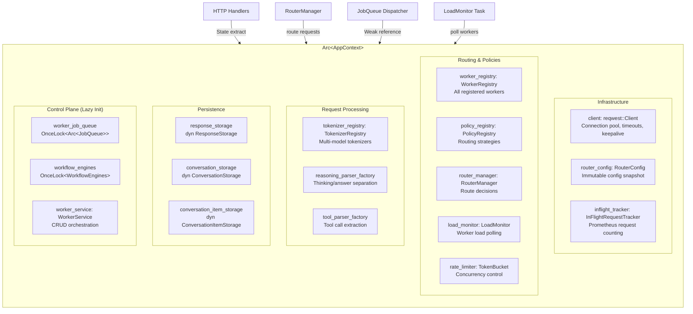
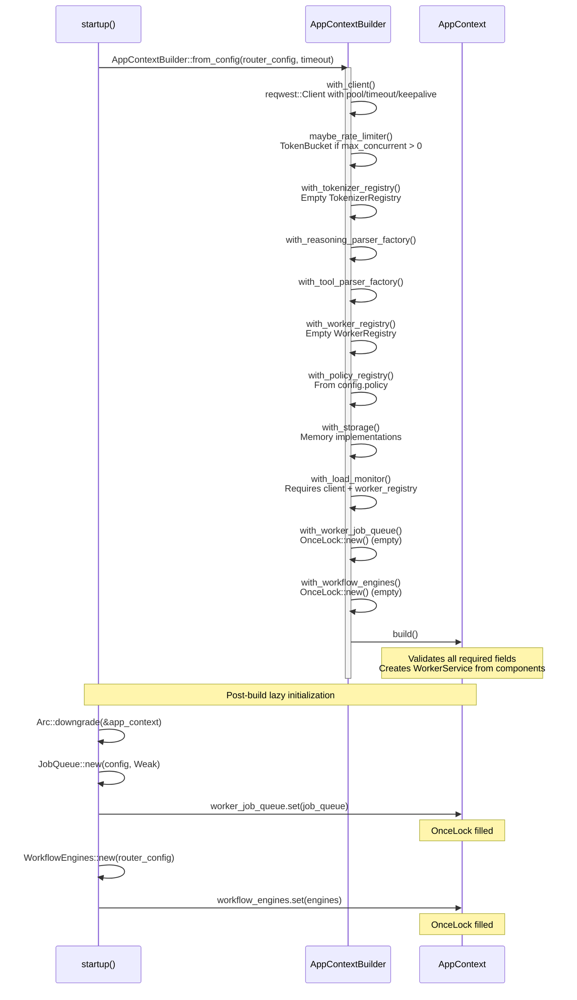
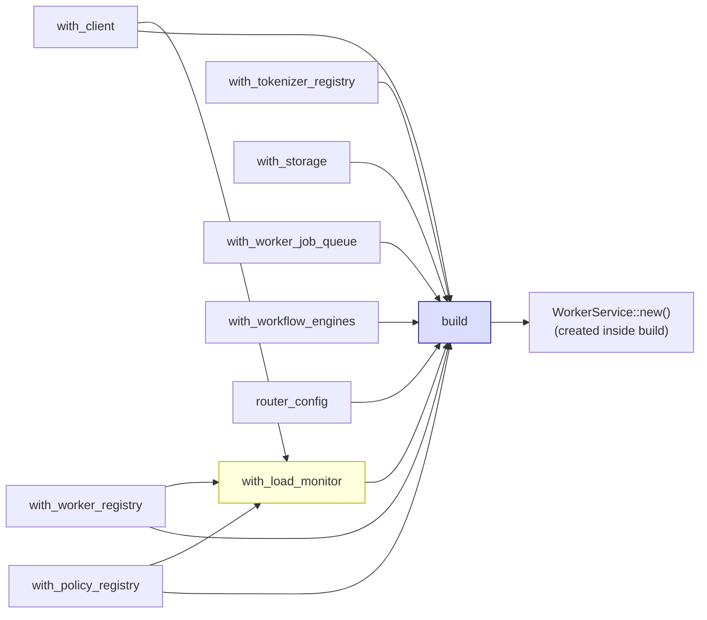
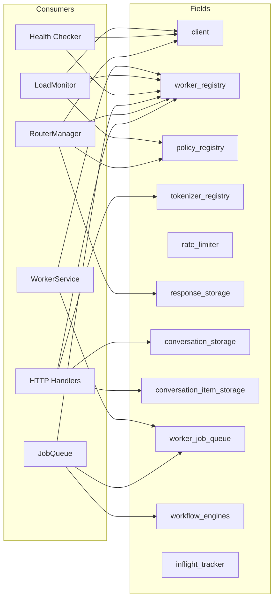
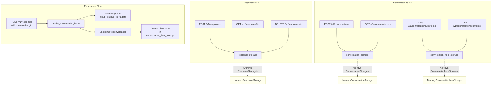
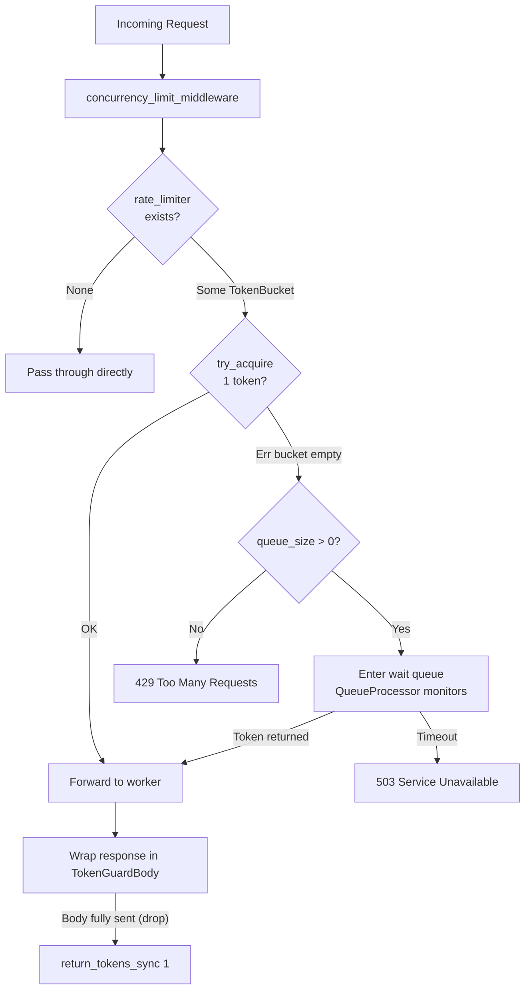

# AppContext Design

Global dependency container for the MESH router — centralizes all shared resources behind `Arc<AppContext>`.

## Architecture Overview

## Builder Initialization Sequence

## Builder Dependency Order

## OnceLock Lazy Initialization

```mermaid
graph TD
    subgraph "Chicken-and-Egg Problem"
        AC1["AppContext needs<br/>JobQueue field"] -->|but| JQ1["JobQueue needs<br/>Weak&lt;AppContext&gt;"]
        JQ1 -->|but| AC1
    end

    subgraph "Solution: OnceLock"
        STEP1["1. Create AppContext<br/>worker_job_queue = OnceLock::new()"]
        STEP2["2. Create JobQueue<br/>with Arc::downgrade(&app_context)"]
        STEP3["3. Fill OnceLock<br/>app_context.worker_job_queue.set(queue)"]
        STEP1 --> STEP2 --> STEP3
    end

    subgraph "Same pattern for WorkflowEngines"
        WE1["1. workflow_engines = OnceLock::new()"]
        WE2["2. WorkflowEngines::new(config)"]
        WE3["3. app_context.workflow_engines.set(engines)"]
        WE1 --> WE2 --> WE3
    end
```

## Consumer Map

Which components use which AppContext fields:

## Storage Layer

## Rate Limiting

