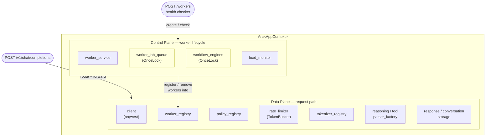

# AppContext Design

Global dependency container for the MESH router — centralizes all shared resources behind `Arc<AppContext>`.

> **Data Plane**: serves every inference request — pick a worker (policy_registry),
> forward (client), parse response (parsers), store if needed (storage).
>
> **Control Plane**: manages worker lifecycle in the background — create, health check,
> update, remove workers via JobQueue + WorkflowEngines. Results flow back into
> worker_registry, which the Data Plane reads.
>
> **OnceLock fields** (yellow): lazily initialized after AppContext creation to break
> a circular dependency (JobQueue needs `Weak<AppContext>`, but AppContext contains JobQueue).
