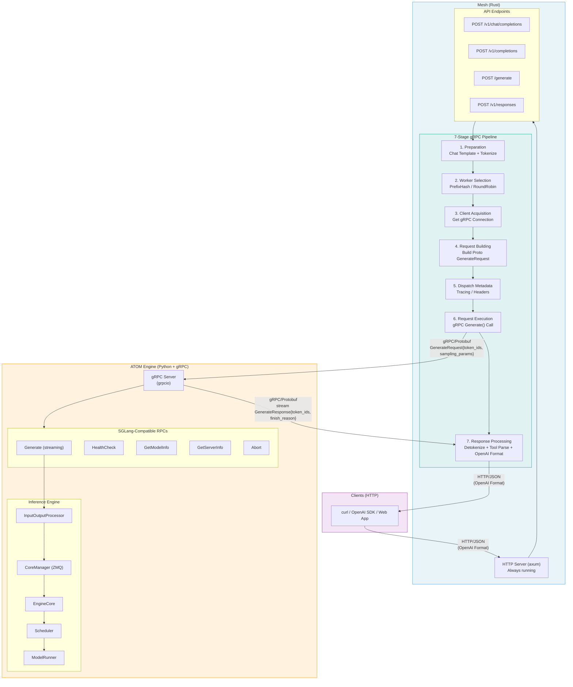
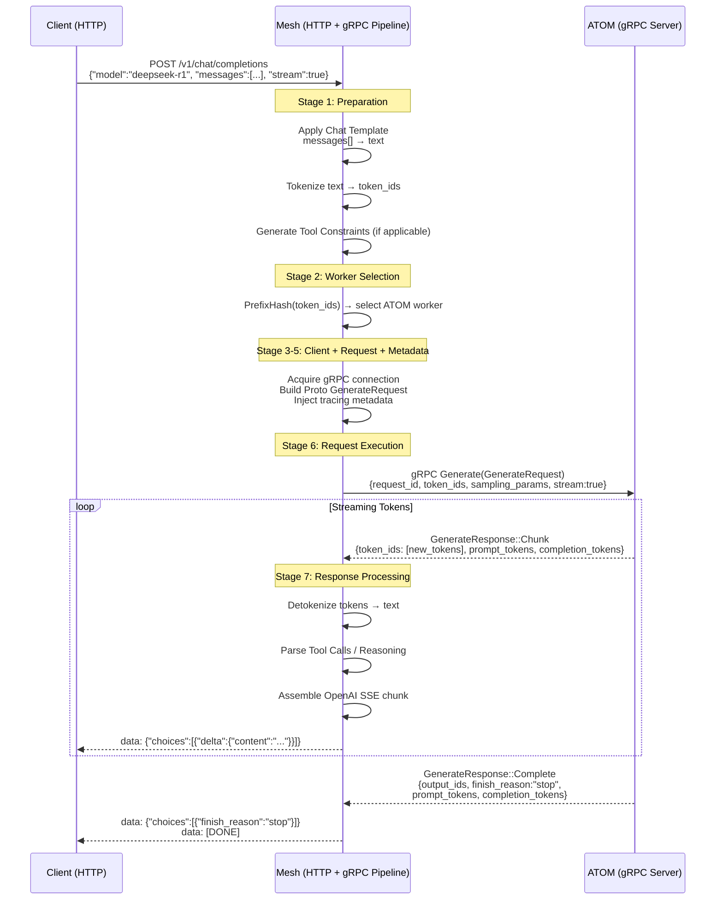
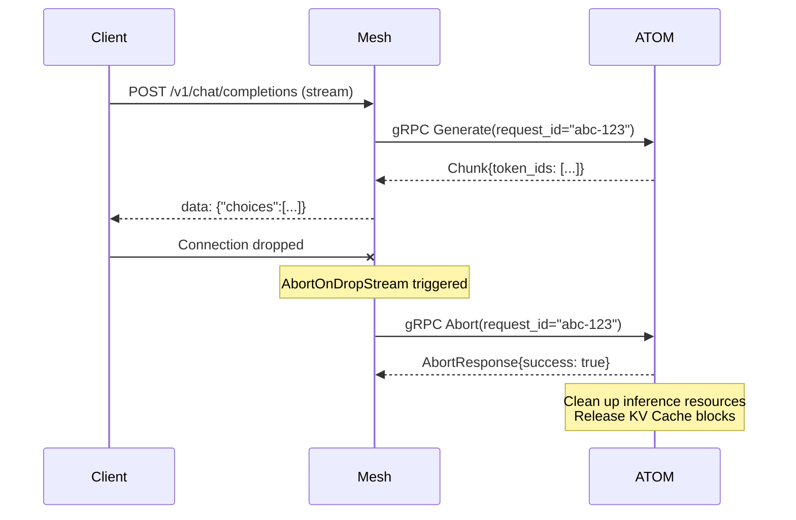
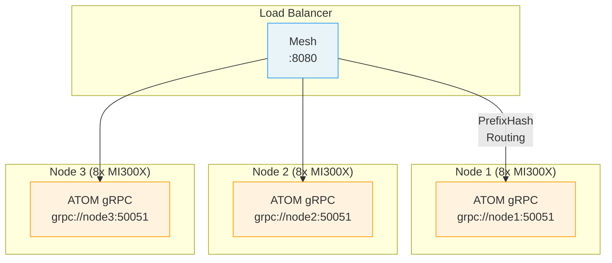
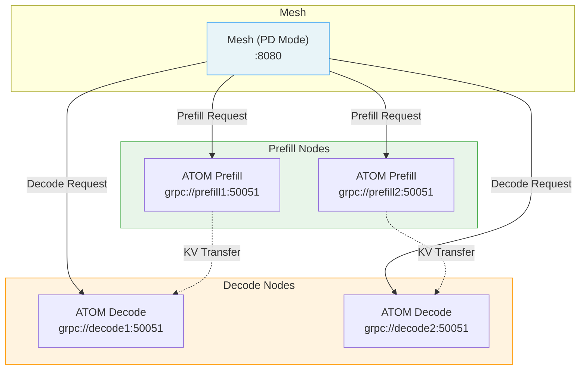

# ATOM gRPC Integration with Mesh

> By implementing a SGLang-compatible gRPC interface, ATOM can integrate with Mesh and reuse all of Mesh's upper-layer capabilities (OpenAI API, Chat Template, Tool Calling, intelligent routing, Prefill-Decode disaggregation, etc.), allowing ATOM to focus solely on inference.

---

## Table of Contents

- [1. Background & Motivation](#1-background--motivation)
- [2. Architecture Overview](#2-architecture-overview)
- [3. Request Lifecycle](#3-request-lifecycle)
- [4. gRPC Interface Specification](#4-grpc-interface-specification)
- [5. Deployment & Configuration](#5-deployment--configuration)

---

## 1. Background & Motivation

### Current State

Mesh supports two connection modes for backend engines:

| Mode | Mesh Responsibility | Engine Responsibility | Use Case |
|------|---------------------|----------------------|----------|
| **HTTP Pass-through** | Load balancing, routing | Full HTTP API (chat template, tokenize, tool parsing, SSE streaming) | Engine already implements full OpenAI API |
| **gRPC Pipeline** | All upper-layer logic (chat template, tokenize, tool parsing, response assembly) | Inference only (tokens in → tokens out) | Engine focuses on inference; upper layer handled uniformly by Mesh |

ATOM currently provides HTTP endpoints (`/v1/chat/completions`, `/v1/completions`) via FastAPI. Using the HTTP pass-through mode would require ATOM to implement all upper-layer logic (chat template application, tool call parsing, etc.) — significant work that duplicates Mesh functionality.

### Why gRPC Mode

```
HTTP pass-through mode: ATOM must handle 8 things
  1. Receive OpenAI format request
  2. Apply Chat Template
  3. Tokenize
  4. Inference
  5. Detokenize
  6. Parse Tool Calls
  7. Separate Reasoning Content
  8. Assemble OpenAI format response + SSE streaming

gRPC mode: ATOM only handles 1 thing
  → Inference (receive token_ids, return token_ids)
  The remaining 7 are handled by Mesh
```

**Key reasons for choosing gRPC mode:**

1. **Minimize ATOM workload** — Only 5 gRPC RPCs to implement, no need to handle OpenAI protocol details
2. **Reuse all Mesh capabilities** — Chat Template, Tool Calling, Reasoning separation, Constrained Generation, etc.
3. **Intelligent routing** — Mesh tokenizes upfront, enabling PrefixHash routing based on token_ids for better KV Cache hit rates
4. **PD disaggregation** — Mesh fully controls Prefill-Decode dual dispatch scheduling; ATOM is unaware of it
5. **Performance advantage** — Protobuf binary serialization + HTTP/2 multiplexing outperforms JSON + SSE
6. **Cross-engine consistency** — The same Mesh pipeline serves SGLang, vLLM, and ATOM with consistent behavior

---

## 2. Architecture Overview

### Overall Architecture



---

## 3. Request Lifecycle

### Full `/v1/chat/completions` Request Flow



### Abort Flow (Client Disconnect)



---

## 4. gRPC Interface Specification

ATOM must implement a SGLang-compatible gRPC Service. The proto definition comes from the `smg-grpc-client` crate v1.0.0.

### Service Definition

```protobuf
service SglangScheduler {
  // Core inference — server-side streaming
  rpc Generate (GenerateRequest) returns (stream GenerateResponse);
  
  // Health check
  rpc HealthCheck (HealthCheckRequest) returns (HealthCheckResponse);
  
  // Model metadata
  rpc GetModelInfo (GetModelInfoRequest) returns (GetModelInfoResponse);
  
  // Server status
  rpc GetServerInfo (GetServerInfoRequest) returns (GetServerInfoResponse);
  
  // Cancel request
  rpc Abort (AbortRequest) returns (AbortResponse);
  
  // ---- Optional RPCs below ----
  
  // Load information (for load-aware routing)
  rpc GetLoads (GetLoadsRequest) returns (GetLoadsResponse);
  
  // Embedding
  rpc Embed (EmbedRequest) returns (EmbedResponse);
}
```

### Required RPCs (5)

#### RPC 1: Generate (Core)

```
Input:  GenerateRequest
Output: stream GenerateResponse
```

**GenerateRequest key fields:**

| Field | Type | Description |
|-------|------|-------------|
| `request_id` | string | Unique request ID (used for Abort correlation) |
| `tokenized.input_ids` | repeated uint32 | **Token IDs pre-tokenized by Mesh** (always populated) |
| `tokenized.original_text` | string | Original text (for reference) |
| `sampling_params` | SamplingParams | Sampling parameters |
| `stream` | bool | Whether to return streaming responses |
| `return_logprob` | bool | Whether to return logprobs |
| `top_logprobs_num` | int32 | Number of top logprobs |
| `data_parallel_rank` | int32 | DP rank (for multi-DP scenarios) |

**SamplingParams key fields:**

| Field | Type | Default | Description |
|-------|------|---------|-------------|
| `temperature` | float | 0 (proto) / 1.0 (semantic) | Sampling temperature |
| `top_p` | float | 1.0 | Nucleus sampling |
| `top_k` | int32 | -1 | Top-k sampling |
| `max_new_tokens` | optional int32 | — | Maximum new tokens to generate |
| `stop` | repeated string | — | Stop strings |
| `stop_token_ids` | repeated uint32 | — | Stop token IDs |
| `repetition_penalty` | float | 1.0 | Repetition penalty |
| `frequency_penalty` | float | 0.0 | Frequency penalty |
| `presence_penalty` | float | 0.0 | Presence penalty |
| `n` | int32 | 1 | Number of parallel samples |
| `ignore_eos` | bool | false | Whether to ignore EOS token |
| `min_new_tokens` | int32 | 0 | Minimum new tokens |
| `constraint` | oneof | — | Constrained generation (regex / json_schema / ebnf_grammar) |

**GenerateResponse (streamed back):**

```protobuf
message GenerateResponse {
  string request_id = 1;
  oneof response {
    GenerateStreamChunk chunk = 2;    // Incremental tokens
    GenerateComplete complete = 3;    // Completion signal
    GenerateError error = 4;          // Error
  }
}
```

**GenerateStreamChunk fields:**

| Field | Type | Description |
|-------|------|-------------|
| `token_ids` | repeated uint32 | Newly generated token IDs in this chunk |
| `prompt_tokens` | int32 | Cumulative prompt token count |
| `completion_tokens` | int32 | Cumulative completion token count |
| `cached_tokens` | int32 | Tokens served from prefix cache |
| `index` | uint32 | Parallel sample index (for n>1) |

**GenerateComplete fields:**

| Field | Type | Description |
|-------|------|-------------|
| `output_ids` | repeated uint32 | All output token IDs |
| `finish_reason` | string | `"stop"` / `"length"` / `"abort"` |
| `prompt_tokens` | int32 | Prompt token count |
| `completion_tokens` | int32 | Completion token count |
| `cached_tokens` | int32 | Cache hit token count |
| `index` | uint32 | Parallel sample index |

**GenerateError fields:**

| Field | Type | Description |
|-------|------|-------------|
| `message` | string | Error message |
| `http_status_code` | string | HTTP status code string |
| `details` | string | Additional error details |

**Streaming protocol:**

```
→ Send 0..N Chunk messages (incremental tokens)
→ Send exactly 1 Complete or Error message (termination signal)
```

> **Note: Token counts are cumulative, not incremental.**

#### RPC 2: HealthCheck

```
Input:  HealthCheckRequest {}  // Empty message
Output: HealthCheckResponse { healthy: bool, message: string }
```

Called by Mesh during worker registration and periodically at runtime to drive circuit breaker state.

#### RPC 3: GetModelInfo

```
Input:  GetModelInfoRequest {}  // Empty message
Output: GetModelInfoResponse {
  model_path: string,              // Model path/name
  tokenizer_path: string,          // Tokenizer path
  is_generation: bool,             // true (generative model)
  served_model_name: string,       // Externally served model name
  max_context_length: int32,       // Maximum context length
  vocab_size: int32,               // Vocabulary size
  supports_vision: bool,           // Whether multimodal is supported
  model_type: string,              // Model type
  eos_token_ids: repeated int32,   // EOS token IDs
  architectures: repeated string,  // Model architectures (e.g. "DeepseekV3ForCausalLM")
}
```

Called once during worker registration. The result is cached as worker labels for model routing and tokenizer loading.

#### RPC 4: GetServerInfo

```
Input:  GetServerInfoRequest {}  // Empty message
Output: GetServerInfoResponse {
  active_requests: int32,       // Number of currently active requests
  is_paused: bool,              // Whether the server has paused accepting new requests
  uptime_seconds: float64,      // Server uptime in seconds
  server_type: string,          // "atom-grpc"
}
```

#### RPC 5: Abort

```
Input:  AbortRequest { request_id: string, reason: string }
Output: AbortResponse { success: bool, message: string }
```

Automatically triggered by Mesh's `AbortOnDropStream` when a client disconnects. ATOM must:
1. Remove the request from the scheduling queue
2. Release allocated KV Cache blocks
3. Stop any in-progress inference for the request

---

## 5. Deployment & Configuration

### Startup

```bash
# Step 1: Start ATOM gRPC Server
python -m atom.entrypoints.grpc_server \
    --model deepseek-ai/DeepSeek-R1 \
    --kv_cache_dtype fp8 \
    -tp 8 \
    --grpc-port 50051

# Step 2: Start Mesh with grpc:// prefix in worker URL
mesh --worker-urls grpc://localhost:50051 \
     --port 8080 \
     --tokenizer deepseek-ai/DeepSeek-R1
```

After detecting the `grpc://` prefix, Mesh automatically:
1. Connects to ATOM using the gRPC client
2. Calls `HealthCheck` to verify the connection
3. Calls `GetModelInfo` to retrieve model metadata
4. Enables the 7-stage gRPC pipeline for all incoming requests

### Multi-Node Deployment



```bash
# Multi-worker configuration
mesh --worker-urls grpc://node1:50051,grpc://node2:50051,grpc://node3:50051 \
     --port 8080 \
     --tokenizer deepseek-ai/DeepSeek-R1 \
     --policy prefix_hash    # Consistent hash routing based on token prefix
```

### PD Disaggregated Deployment



```bash
# PD disaggregated configuration
mesh --prefill grpc://prefill1:50051,grpc://prefill2:50051 \
     --decode grpc://decode1:50051,grpc://decode2:50051 \
     --port 8080 \
     --tokenizer deepseek-ai/DeepSeek-R1
```

---

## Appendix: Key Source References

| Component | File Path | Description |
|-----------|-----------|-------------|
| Mesh route registration | `mesh/src/server.rs:484-520` | HTTP endpoint definitions |
| Connection mode detection | `mesh/src/main.rs:430-437` | `grpc://` prefix detection |
| gRPC Pipeline | `mesh/src/routers/grpc/pipeline.rs:47-88` | 7-stage pipeline construction |
| gRPC Client | `mesh/src/routers/grpc/client.rs:72-86` | `GrpcClient::connect()` |
| Worker Selection | `mesh/src/routers/grpc/common/stages/worker_selection.rs` | PrefixHash routing |
| Streaming response conversion | `mesh/src/routers/grpc/regular/streaming.rs:178-593` | gRPC stream → SSE |
| Tool Call parsing | `mesh/src/routers/grpc/regular/processor.rs:304-356` | Output parsing |
| Proto definition | `smg-grpc-client` crate v1.0.0 (crates.io) | SGLang gRPC proto |
