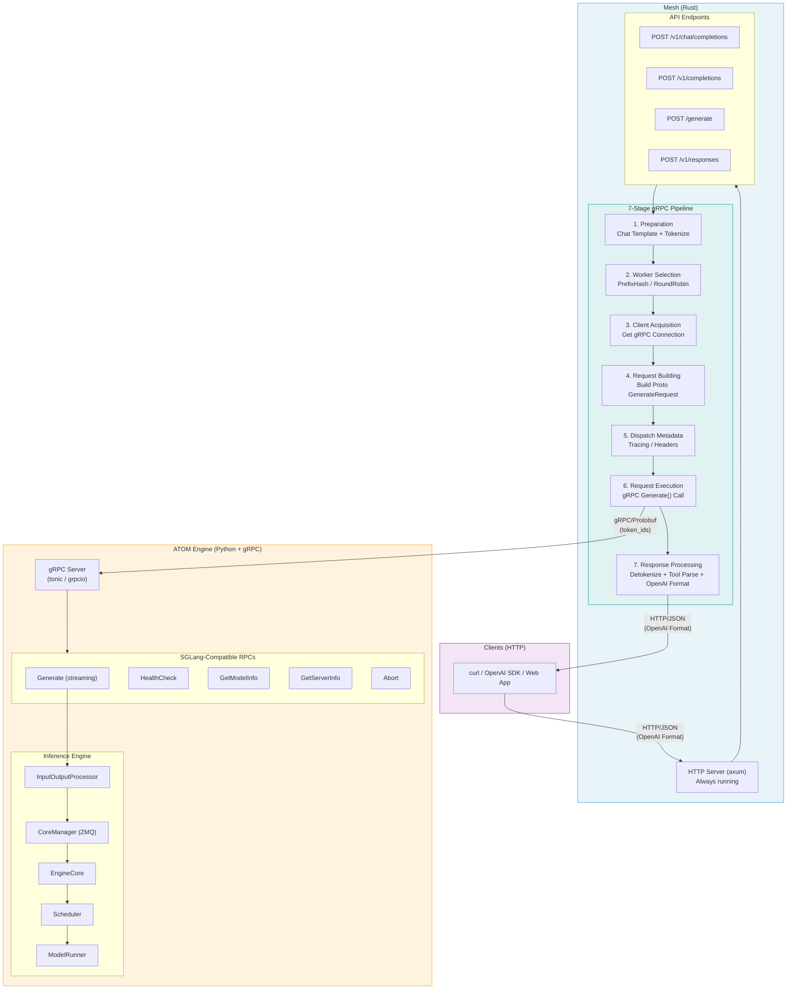
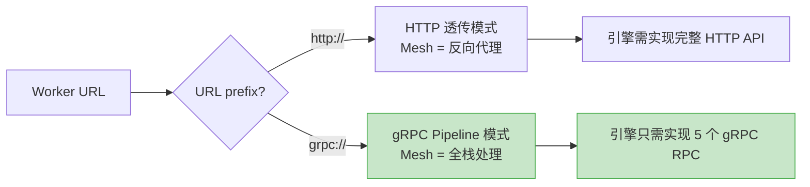
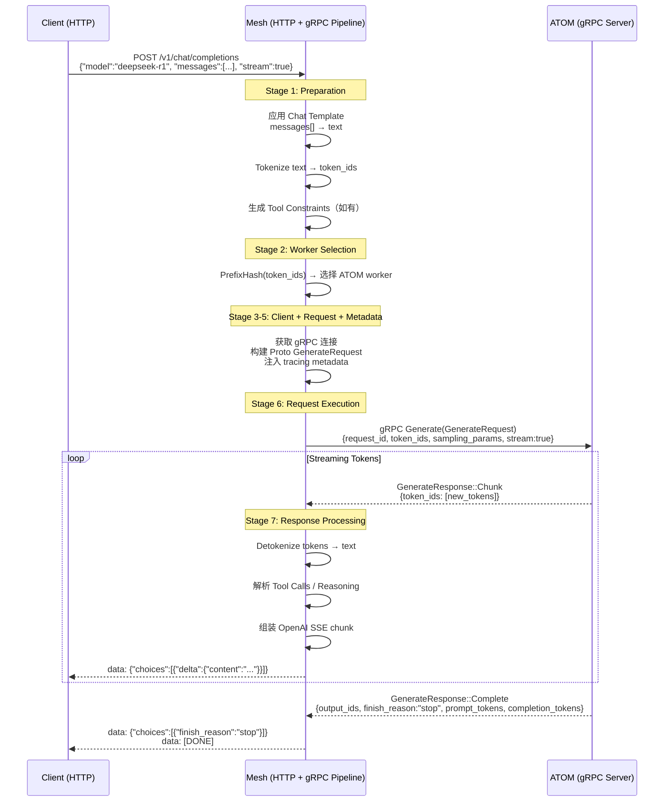
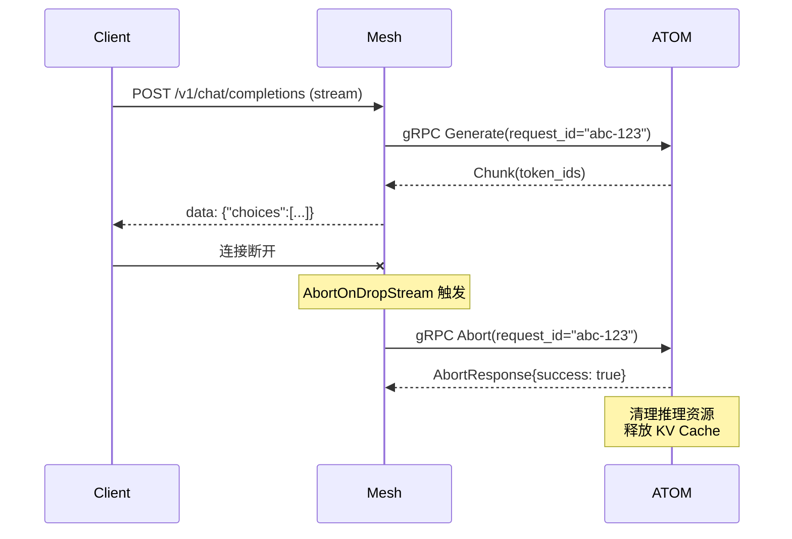
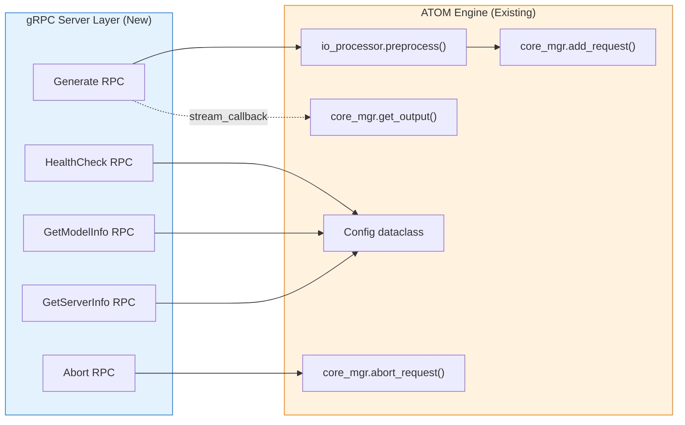
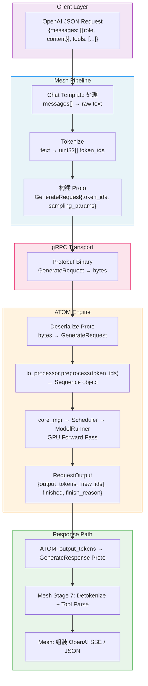
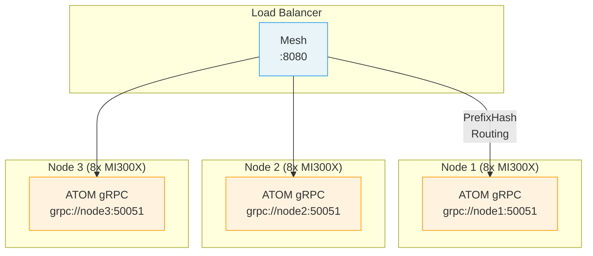
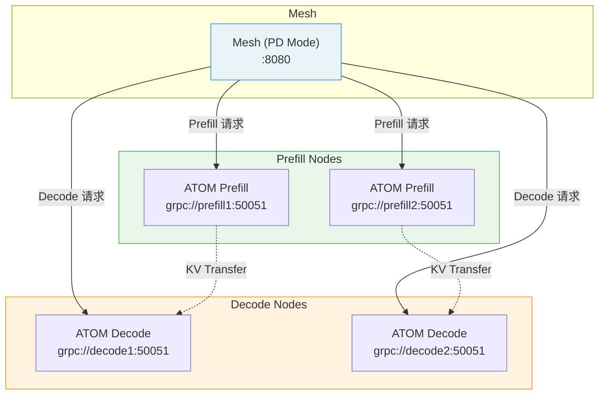

# ATOM gRPC Integration with Mesh

> ATOM 通过实现 SGLang 兼容的 gRPC 接口接入 Mesh，复用 Mesh 的全部上层能力（OpenAI API、Chat Template、Tool Calling、智能路由、PD 分离等），ATOM 自身仅需专注于推理。

---

## Table of Contents

- [1. Background & Motivation](#1-background--motivation)
- [2. Architecture Overview](#2-architecture-overview)
- [3. Request Lifecycle](#3-request-lifecycle)
- [4. gRPC Interface Specification](#4-grpc-interface-specification)
- [5. ATOM Engine Integration Points](#5-atom-engine-integration-points)
- [6. Data Flow Details](#6-data-flow-details)
- [7. Deployment & Configuration](#7-deployment--configuration)
- [8. Implementation Roadmap](#8-implementation-roadmap)

---

## 1. Background & Motivation

### 现状

当前 Mesh 对后端引擎有两种连接模式：

| 模式 | Mesh 职责 | 引擎职责 | 适用场景 |
|------|-----------|----------|----------|
| **HTTP 透传** | 负载均衡、路由 | 完整 HTTP API（chat template、tokenize、tool parsing、SSE 流式） | 引擎已实现完整 OpenAI API |
| **gRPC Pipeline** | 全部上层逻辑（chat template、tokenize、tool parsing、响应组装） | 仅推理（tokens in → tokens out） | 引擎专注推理，上层由 Mesh 统一处理 |

ATOM 目前通过 FastAPI 提供 HTTP 端点（`/v1/chat/completions`、`/v1/completions`），如果走 HTTP 透传模式，ATOM 需要自行实现所有上层逻辑（chat template 应用、tool call 解析等），工作量大且与 Mesh 功能重复。

### 为什么选择 gRPC 模式

```
HTTP 透传模式：ATOM 需要做 8 件事
  1. 接收 OpenAI 格式请求
  2. 应用 Chat Template
  3. Tokenize
  4. 推理
  5. Detokenize
  6. 解析 Tool Calls
  7. 分离 Reasoning Content
  8. 组装 OpenAI 格式响应 + SSE 流式

gRPC 模式：ATOM 只需要做 1 件事
  → 推理（接收 token_ids，返回 token_ids）
  其余 7 件事由 Mesh 完成
```

**选择 gRPC 模式的核心理由：**

1. **最小化 ATOM 工作量** — 只需实现 5 个 gRPC RPC，无需处理 OpenAI 协议细节
2. **复用 Mesh 全部能力** — Chat Template、Tool Calling、Reasoning 分离、Constrained Generation 等
3. **智能路由** — Mesh 提前 tokenize 后可基于 token_ids 做 PrefixHash 路由，提高 KV Cache 命中率
4. **PD 分离** — Mesh 完全控制 Prefill-Decode 双发调度，ATOM 无需感知
5. **性能优势** — Protobuf 二进制序列化 + HTTP/2 多路复用，优于 JSON + SSE
6. **跨引擎一致性** — 同一套 Mesh pipeline 同时对接 SGLang、vLLM、ATOM，行为一致

---

## 2. Architecture Overview

### 整体架构



### 连接模式自动检测

Mesh 根据 worker URL 前缀自动选择连接模式，无需额外配置：



---

## 3. Request Lifecycle

### `/v1/chat/completions` 完整请求流程



### Abort 流程（客户端断开）



---

## 4. gRPC Interface Specification

ATOM 需要实现 SGLang 兼容的 gRPC Service。Proto 定义来自 `smg-grpc-client` crate v1.0.0。

### Service Definition

```protobuf
service SglangScheduler {
  // 核心推理 — 服务端流式
  rpc Generate (GenerateRequest) returns (stream GenerateResponse);
  
  // 健康检查
  rpc HealthCheck (HealthCheckRequest) returns (HealthCheckResponse);
  
  // 模型元数据
  rpc GetModelInfo (GetModelInfoRequest) returns (GetModelInfoResponse);
  
  // 服务器状态
  rpc GetServerInfo (GetServerInfoRequest) returns (GetServerInfoResponse);
  
  // 取消请求
  rpc Abort (AbortRequest) returns (AbortResponse);
  
  // ---- 以下可选 ----
  
  // 负载信息（用于负载感知路由）
  rpc GetLoads (GetLoadsRequest) returns (GetLoadsResponse);
  
  // Embedding
  rpc Embed (EmbedRequest) returns (EmbedResponse);
}
```

### 必须实现的 5 个 RPC

#### RPC 1: Generate（核心）

```
输入: GenerateRequest
输出: stream GenerateResponse
```

**GenerateRequest 关键字段：**

| 字段 | 类型 | 说明 |
|------|------|------|
| `request_id` | string | 请求唯一 ID（用于 Abort 关联） |
| `tokenized.input_ids` | repeated uint32 | **Mesh 已分好的 token IDs**（始终填充） |
| `tokenized.original_text` | string | 原始文本（参考用） |
| `sampling_params` | SamplingParams | 采样参数 |
| `stream` | bool | 是否流式返回 |
| `return_logprob` | bool | 是否返回 logprobs |
| `top_logprobs_num` | int32 | top logprobs 数量 |
| `data_parallel_rank` | int32 | DP rank（多 DP 场景） |

**SamplingParams 关键字段：**

| 字段 | 类型 | 默认值 | 说明 |
|------|------|--------|------|
| `temperature` | float | 0 (proto) / 1.0 (语义) | 采样温度 |
| `top_p` | float | 1.0 | nucleus sampling |
| `top_k` | int32 | -1 | top-k sampling |
| `max_new_tokens` | optional int32 | — | 最大新 token 数 |
| `stop` | repeated string | — | 停止字符串 |
| `stop_token_ids` | repeated uint32 | — | 停止 token IDs |
| `repetition_penalty` | float | 1.0 | 重复惩罚 |
| `frequency_penalty` | float | 0.0 | 频率惩罚 |
| `presence_penalty` | float | 0.0 | 存在惩罚 |
| `n` | int32 | 1 | 并行采样数 |
| `ignore_eos` | bool | false | 是否忽略 EOS |
| `min_new_tokens` | int32 | 0 | 最小新 token 数 |
| `constraint` | oneof | — | 约束生成（regex / json_schema / ebnf_grammar） |

**GenerateResponse（流式返回）：**

```
oneof response {
  GenerateStreamChunk chunk = 2;   // 增量 token
  GenerateComplete complete = 3;   // 完成信号
  GenerateError error = 4;         // 错误
}
```

**GenerateStreamChunk 字段：**

| 字段 | 类型 | 说明 |
|------|------|------|
| `token_ids` | repeated uint32 | 本次新增的 token IDs |
| `prompt_tokens` | int32 | 累计 prompt token 数 |
| `completion_tokens` | int32 | 累计 completion token 数 |
| `cached_tokens` | int32 | 命中 prefix cache 的 token 数 |
| `index` | uint32 | 并行采样 index（n>1 时用） |

**GenerateComplete 字段：**

| 字段 | 类型 | 说明 |
|------|------|------|
| `output_ids` | repeated uint32 | 全部输出 token IDs |
| `finish_reason` | string | `"stop"` / `"length"` / `"abort"` |
| `prompt_tokens` | int32 | prompt token 数 |
| `completion_tokens` | int32 | completion token 数 |
| `cached_tokens` | int32 | cache 命中 token 数 |
| `index` | uint32 | 并行采样 index |

**流式协议：**

```
→ 发送 0~N 个 Chunk（增量 token）
→ 最后发送 1 个 Complete 或 Error（终止信号）
```

> **注意：token 计数是累计值，不是增量值。**

#### RPC 2: HealthCheck

```
输入: HealthCheckRequest {}  // 空消息
输出: HealthCheckResponse { healthy: bool, message: string }
```

Mesh 在 worker 注册和运行时周期性调用，用于驱动断路器状态。

#### RPC 3: GetModelInfo

```
输入: GetModelInfoRequest {}  // 空消息
输出: GetModelInfoResponse {
  model_path: string,              // 模型路径/名称
  tokenizer_path: string,          // tokenizer 路径
  is_generation: bool,             // true（生成模型）
  served_model_name: string,       // 对外服务名
  max_context_length: int32,       // 最大上下文长度
  vocab_size: int32,               // 词表大小
  supports_vision: bool,           // 是否支持多模态
  model_type: string,              // 模型类型
  eos_token_ids: repeated int32,   // EOS token IDs
  architectures: repeated string,  // 模型架构（如 "DeepseekV3ForCausalLM"）
}
```

Mesh 在 worker 首次注册时调用一次，结果缓存为 worker labels，用于模型路由和 tokenizer 加载。

#### RPC 4: GetServerInfo

```
输入: GetServerInfoRequest {}  // 空消息
输出: GetServerInfoResponse {
  active_requests: int32,       // 当前活跃请求数
  is_paused: bool,              // 是否暂停接收新请求
  uptime_seconds: float64,      // 运行时间
  server_type: string,          // "atom-grpc"
}
```

#### RPC 5: Abort

```
输入: AbortRequest { request_id: string, reason: string }
输出: AbortResponse { success: bool, message: string }
```

当客户端断开连接时，Mesh 的 `AbortOnDropStream` 自动触发此 RPC，ATOM 需要：
1. 从调度队列中移除该请求
2. 释放已分配的 KV Cache blocks
3. 停止正在进行的推理

---

## 5. ATOM Engine Integration Points

### 现有 ATOM 推理接口

```python
# atom/model_engine/llm_engine.py
class LLMEngine:
    io_processor: InputOutputProcessor  # 预处理：tokenize + 构建 Sequence
    core_mgr: CoreManager               # 管理 EngineCore 子进程（ZMQ IPC）

# 核心调用路径（HTTP server 和 gRPC server 均使用）：
seq = engine.io_processor.preprocess(
    prompt_or_tokens,    # str | list[int]  ← gRPC 传入 token_ids
    sampling_params,     # SamplingParams
    stream_callback,     # Callable[[RequestOutput], None]  ← gRPC 用此回调推流
)
engine.core_mgr.add_request([seq])
```

### gRPC Server 调用 ATOM 引擎的映射



### RPC → ATOM 映射详表

| gRPC RPC | ATOM 调用 | 说明 |
|----------|-----------|------|
| `Generate` | `io_processor.preprocess(token_ids, params, callback)` + `core_mgr.add_request([seq])` | 传入 token_ids（非 text），callback 将 `RequestOutput` 转为 `GenerateResponse` 推入 gRPC stream |
| `HealthCheck` | 检查 `core_mgr` 连接状态 | 返回 `{healthy: True}` |
| `GetModelInfo` | 读取 `engine.config` | 映射 `config.model` → `model_path`，`config.max_model_len` → `max_context_length` 等 |
| `GetServerInfo` | 读取运行时状态 | 活跃请求计数、uptime |
| `Abort` | `core_mgr.abort_request(request_id)` | 需在 CoreManager 中新增 abort 能力（如已有则直接调用） |

### SamplingParams 映射

```python
# Proto SamplingParams → ATOM SamplingParams
def convert_sampling_params(proto_params) -> SamplingParams:
    return SamplingParams(
        temperature=proto_params.temperature or 1.0,  # proto default 0 → 语义 default 1.0
        top_k=proto_params.top_k if proto_params.top_k != 0 else -1,
        top_p=proto_params.top_p if proto_params.top_p != 0.0 else 1.0,
        max_tokens=proto_params.max_new_tokens or 64,
        stop_strings=list(proto_params.stop) or None,
        ignore_eos=proto_params.ignore_eos,
    )
```

### RequestOutput → GenerateResponse 映射

```python
# ATOM RequestOutput → Proto GenerateResponse
def convert_to_chunk(output: RequestOutput, cumulative_tokens: int) -> GenerateResponse:
    if not output.finished:
        return GenerateResponse(
            chunk=GenerateStreamChunk(
                token_ids=output.output_tokens,
                completion_tokens=cumulative_tokens,
                prompt_tokens=seq.num_prompt_tokens,
            )
        )
    else:
        return GenerateResponse(
            complete=GenerateComplete(
                output_ids=all_output_tokens,
                finish_reason=map_finish_reason(output.finish_reason),
                prompt_tokens=seq.num_prompt_tokens,
                completion_tokens=cumulative_tokens,
            )
        )

def map_finish_reason(reason: str) -> str:
    # ATOM → SGLang 格式
    return {
        "eos": "stop",
        "stop_sequence": "stop",
        "max_tokens": "length",
        "abort": "abort",
    }.get(reason, "stop")
```

---

## 6. Data Flow Details

### 数据格式在各层的变化



### Mesh 提供的上层能力（ATOM 无需实现）

| 能力 | 说明 | Mesh 实现位置 |
|------|------|---------------|
| Chat Template | 应用 Jinja2 模板拼接 messages | `ChatPreparationStage` |
| Tokenize / Detokenize | HuggingFace Tokenizer | `PreparationStage` / `ResponseProcessingStage` |
| Tool Call 解析 | 从模型输出解析 function call JSON | `processor.rs::parse_tool_calls()` |
| Reasoning 分离 | 分离 `<think>` 标签中的推理内容 | `streaming.rs` reasoning parser |
| Constrained Generation | 自动生成 JSON Schema / regex 约束 | `ChatPreparationStage` |
| PrefixHash 路由 | 基于 token_ids 前缀的一致性哈希路由 | `WorkerSelectionStage` |
| PD 分离调度 | Prefill / Decode 双发到不同 worker | `RequestExecutionStage::DualDispatch` |
| SSE 流式响应 | 组装 `text/event-stream` 格式 | `streaming.rs::build_sse_response()` |
| 重试 / 断路器 | 失败自动重试 + worker 熔断 | `RetryExecutor` + health check |

---

## 7. Deployment & Configuration

### 启动方式

```bash
# Step 1: 启动 ATOM gRPC Server
python -m atom.entrypoints.grpc_server \
    --model deepseek-ai/DeepSeek-R1 \
    --kv_cache_dtype fp8 \
    -tp 8 \
    --grpc-port 50051

# Step 2: 启动 Mesh，worker URL 使用 grpc:// 前缀
mesh --worker-urls grpc://localhost:50051 \
     --port 8080 \
     --tokenizer deepseek-ai/DeepSeek-R1
```

Mesh 检测到 `grpc://` 前缀后自动：
1. 使用 gRPC 客户端连接 ATOM
2. 调用 `HealthCheck` 验证连接
3. 调用 `GetModelInfo` 获取模型元数据
4. 启用 7-stage gRPC pipeline 处理所有请求

### 多节点部署



```bash
# 多 worker 配置
mesh --worker-urls grpc://node1:50051,grpc://node2:50051,grpc://node3:50051 \
     --port 8080 \
     --tokenizer deepseek-ai/DeepSeek-R1 \
     --policy prefix_hash    # 基于 token 前缀的一致性哈希路由
```

### PD 分离部署



```bash
# PD 分离配置
mesh --prefill grpc://prefill1:50051,grpc://prefill2:50051 \
     --decode grpc://decode1:50051,grpc://decode2:50051 \
     --port 8080 \
     --tokenizer deepseek-ai/DeepSeek-R1
```

---

## 8. Implementation Roadmap

### Phase 1: Minimal Viable gRPC Server

新增文件：`atom/entrypoints/grpc_server.py`

**目标：** 实现 5 个必须 RPC，能通过 Mesh gRPC pipeline 完成基本推理。

```
atom/
├── entrypoints/
│   ├── openai_server.py          # 现有 HTTP 服务（保持不变）
│   └── grpc_server.py            # 新增 gRPC 服务
├── grpc/
│   ├── __init__.py
│   ├── server.py                 # gRPC server 启动逻辑
│   ├── servicer.py               # SglangScheduler service 实现
│   └── proto/                    # Proto 生成代码（从 smg-grpc-client 对齐）
│       ├── sglang_scheduler_pb2.py
│       └── sglang_scheduler_pb2_grpc.py
└── ...
```

**实现优先级：**

| 优先级 | RPC | 复杂度 | 说明 |
|--------|-----|--------|------|
| P0 | `Generate` (非流式) | 中 | 先实现非流式，验证端到端 |
| P0 | `HealthCheck` | 低 | 返回 `{healthy: true}` |
| P0 | `GetModelInfo` | 低 | 从 `engine.config` 读取 |
| P0 | `GetServerInfo` | 低 | 返回基本状态 |
| P1 | `Generate` (流式) | 中 | stream_callback → gRPC stream |
| P1 | `Abort` | 中 | 需要 CoreManager 支持取消 |

### Phase 2: Production Hardening

- 连接管理：gRPC keepalive、超时、重连
- 并发控制：请求并发数限制
- 监控指标：Prometheus metrics 导出
- 错误处理：优雅的 `GenerateError` 返回

### Phase 3: Advanced Features

- `GetLoads` RPC：导出调度器负载信息，支持 Mesh 负载感知路由
- `Embed` RPC：支持 embedding 模型
- PD 分离支持：实现 `DisaggregatedParams` 处理（KV cache transfer）
- Data Parallel 支持：`data_parallel_rank` 路由到正确的 DP rank

---

## Appendix: Key Source References

| 组件 | 文件路径 | 说明 |
|------|----------|------|
| Mesh 路由注册 | `mesh/src/server.rs:484-520` | HTTP 端点定义 |
| 连接模式检测 | `mesh/src/main.rs:430-437` | `grpc://` 前缀检测 |
| gRPC Pipeline | `mesh/src/routers/grpc/pipeline.rs:47-88` | 7-stage 构建 |
| gRPC Client | `mesh/src/routers/grpc/client.rs:72-86` | `GrpcClient::connect()` |
| Worker Selection | `mesh/src/routers/grpc/common/stages/worker_selection.rs` | PrefixHash 路由 |
| 流式响应转换 | `mesh/src/routers/grpc/regular/streaming.rs:178-593` | gRPC stream → SSE |
| Tool Call 解析 | `mesh/src/routers/grpc/regular/processor.rs:304-356` | 输出解析 |
| Proto 定义 | `smg-grpc-client` crate v1.0.0 (crates.io) | SGLang gRPC proto |
| ATOM HTTP Server | `atom/entrypoints/openai_server.py` | 现有入口（参考） |
| ATOM Engine | `atom/model_engine/llm_engine.py` | `LLMEngine` 接口 |
| ATOM 预处理 | `atom/model_engine/llm_engine.py:167` | `io_processor.preprocess()` |
| ATOM 采样参数 | `atom/sampling_params.py` | `SamplingParams` 定义 |
| ATOM 配置 | `atom/config.py:738` | `Config` dataclass |
