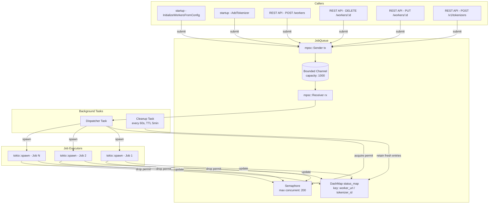
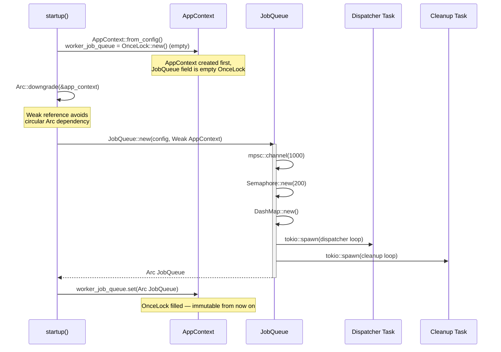
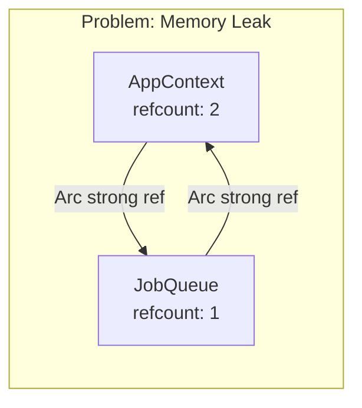
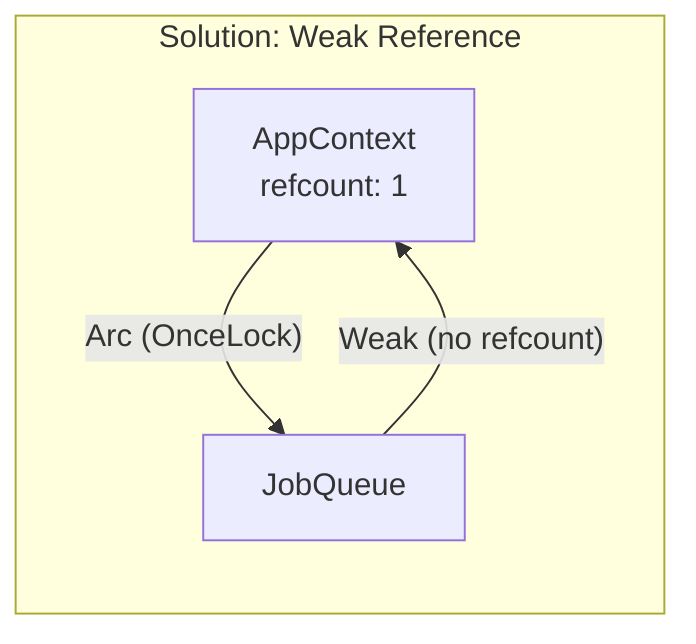
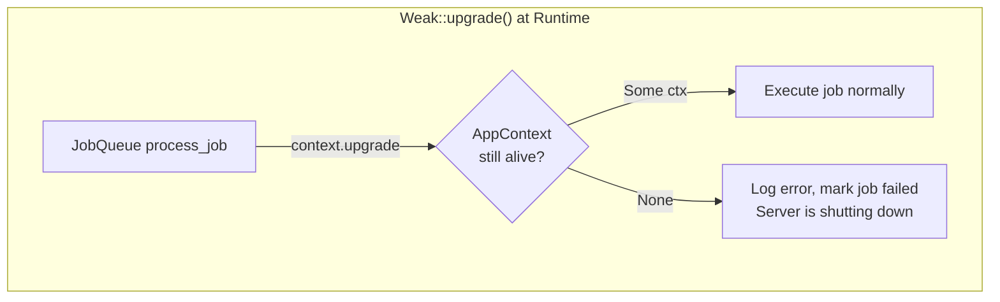
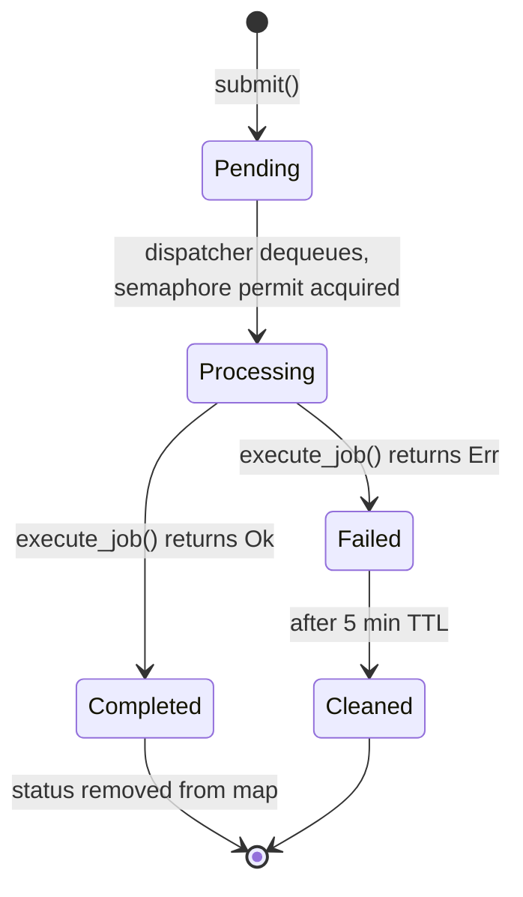
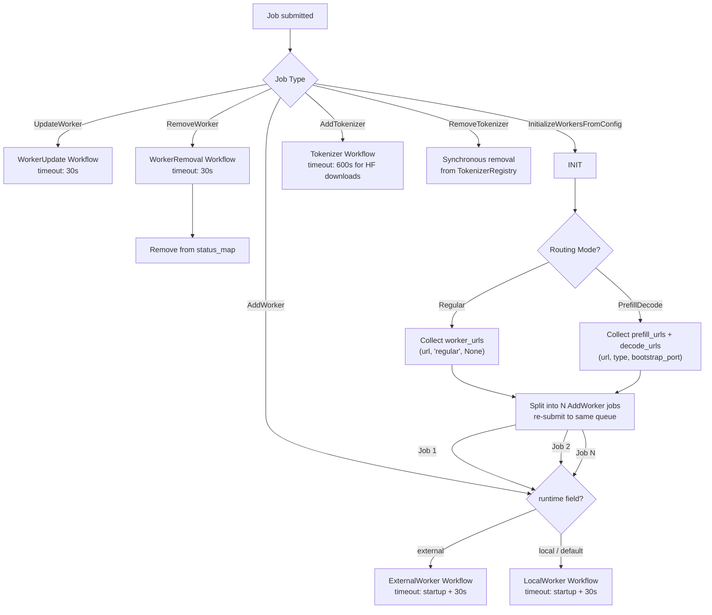
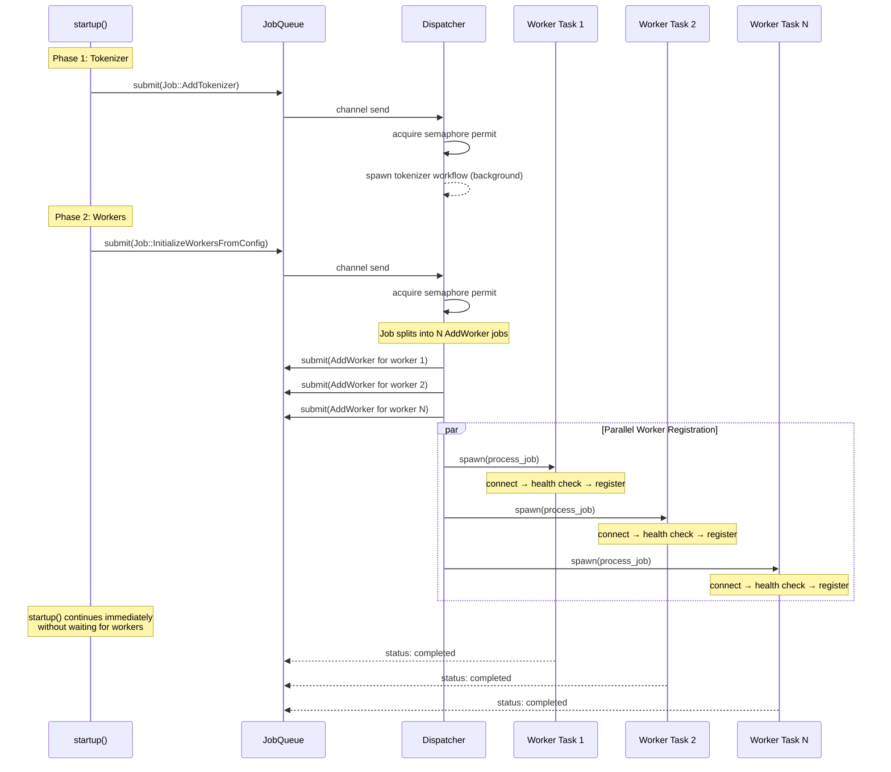
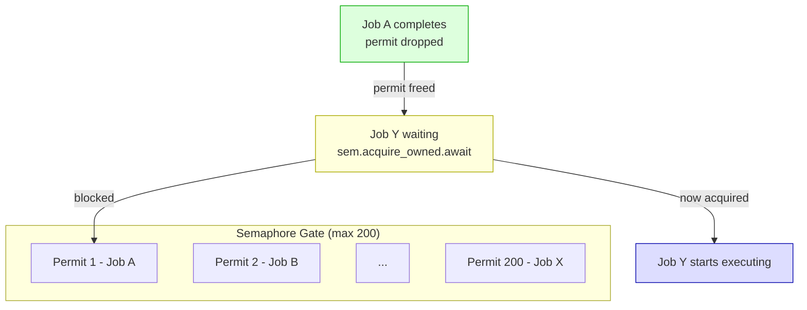

# JobQueue Design

Async job queue for control plane operations — worker and tokenizer lifecycle management.

## Architecture Overview

## Initialization Sequence

## Circular Reference Problem & Solution

## Job Lifecycle

## Job Types & Execution

## Startup Job Flow

## Concurrency Control

## Key Design Decisions

| Decision | Rationale |
|----------|-----------|
| `Weak<AppContext>` instead of `Arc` | Breaks circular reference: AppContext → JobQueue → AppContext |
| `OnceLock` for storing JobQueue in AppContext | AppContext must be created before JobQueue (chicken-and-egg), OnceLock allows deferred one-time init |
| Bounded channel (1000) | Backpressure: `submit()` blocks if queue is full, prevents unbounded memory growth |
| Semaphore (200) | Limits concurrent workflow executions, prevents overwhelming the system during bulk operations |
| `InitializeWorkersFromConfig` splits into `AddWorker` jobs | Reuses the same registration workflow, enables parallel worker init with shared concurrency control |
| DashMap for status tracking | Lock-free concurrent HashMap, safe for reads/writes from dispatcher + cleanup + API handlers |
| 5-minute TTL cleanup | Prevents status_map from growing unbounded while keeping recent results queryable |
