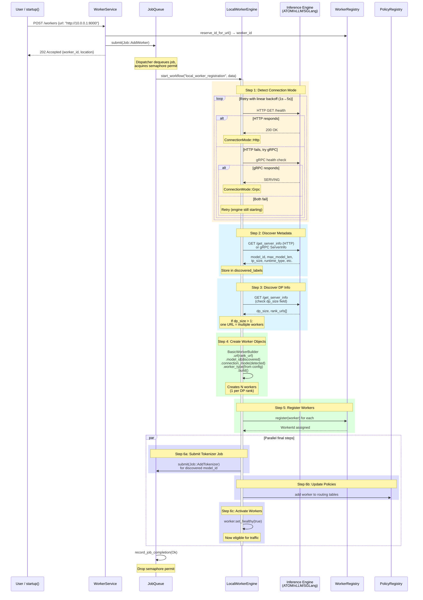
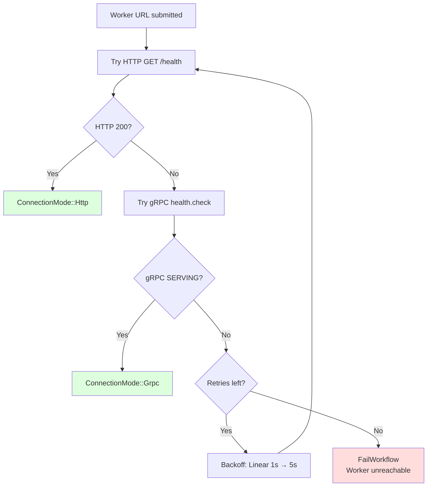
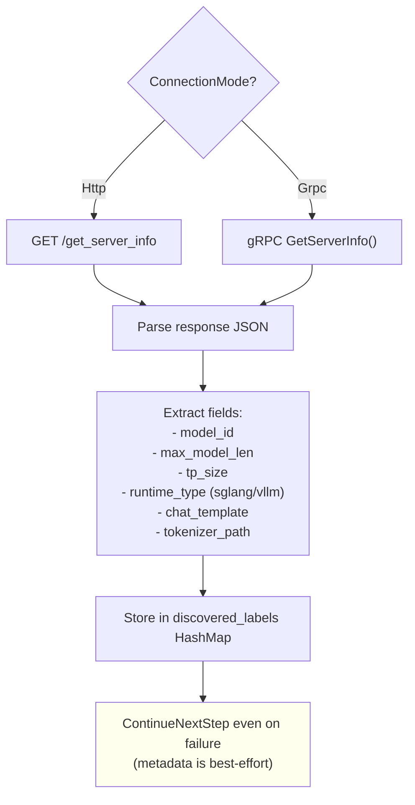
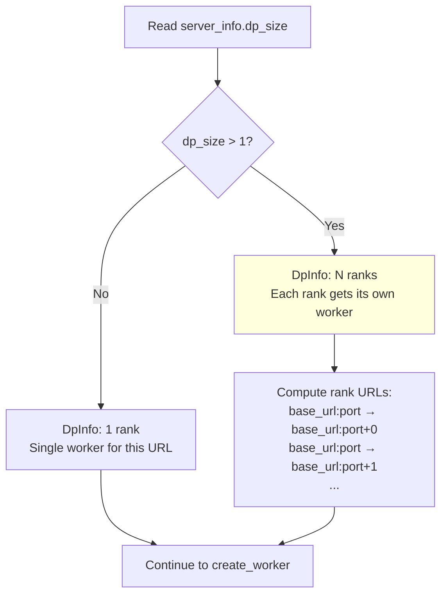
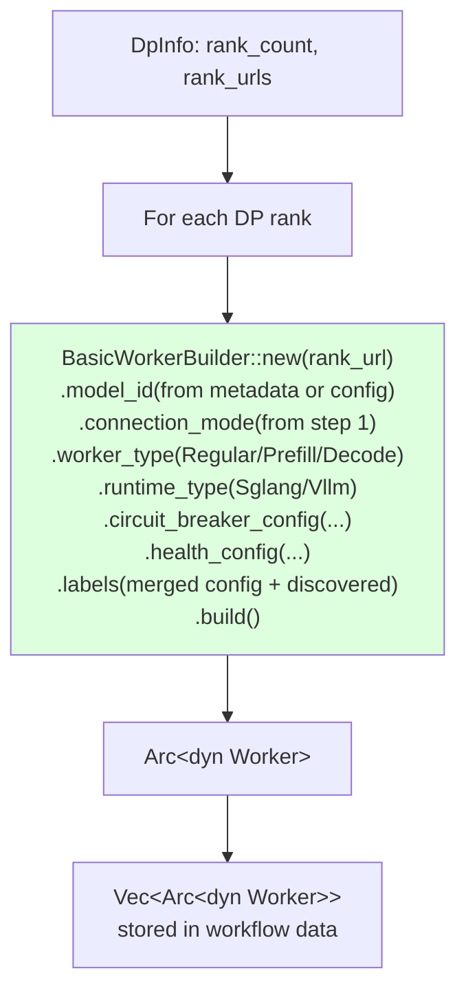
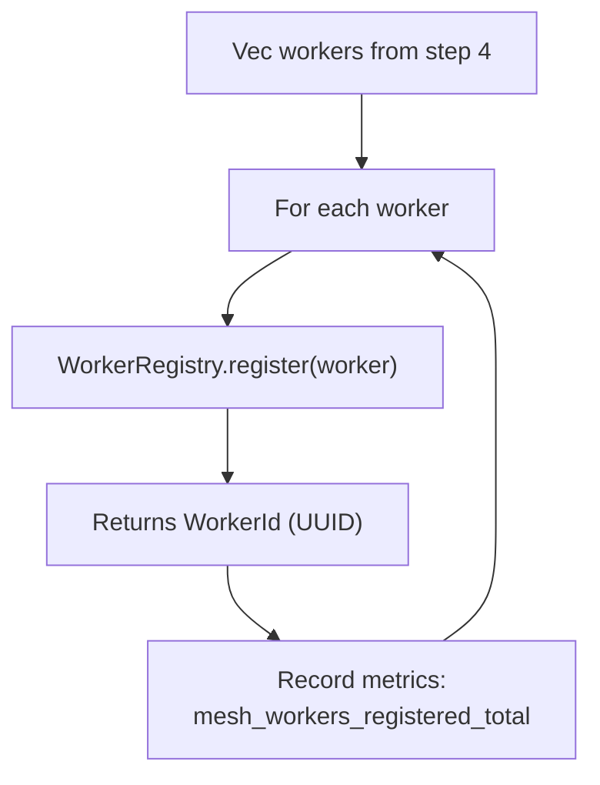
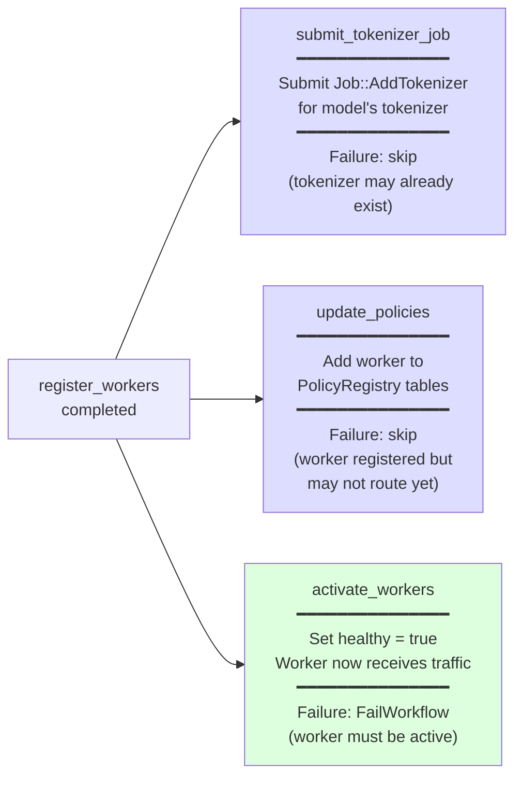
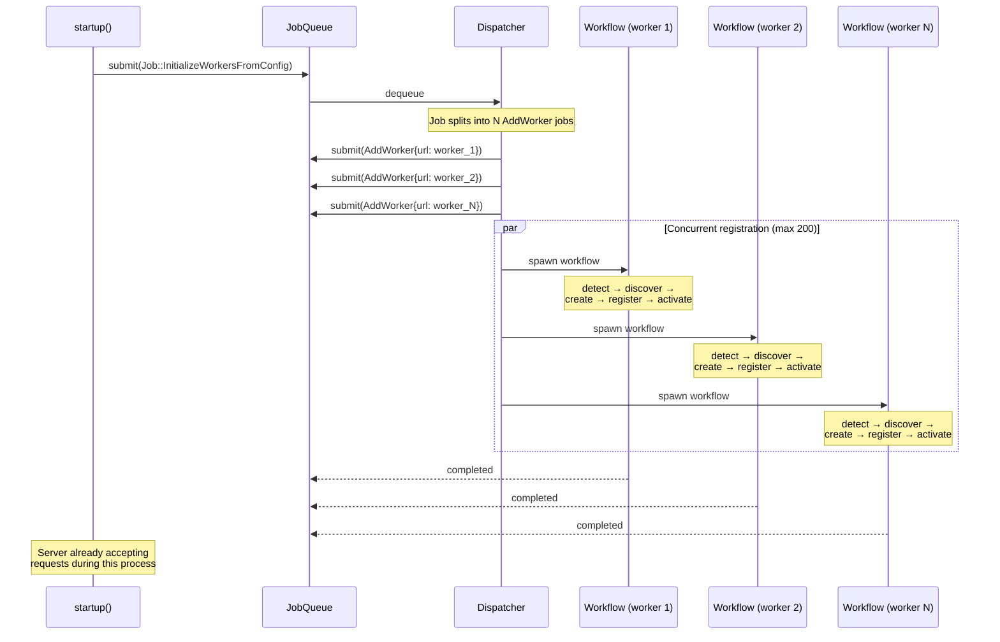

# Local Worker Registration

Detailed design of the local worker registration workflow — how MESH discovers, connects to, and registers locally deployed inference engines (ATOM, vLLM, SGLang).

## Overview

When a worker URL is submitted (via startup config or REST API), the system must:
1. Wait for the engine to be ready
2. Detect whether it speaks HTTP or gRPC
3. Pull metadata (model_id, capabilities)
4. Handle Data Parallel (DP) — one URL may have multiple DP ranks behind it
5. Create typed Worker objects
6. Register them in the routing infrastructure
7. Load the tokenizer for the model

## Full Registration Flow

## Step Details

### Step 1: Detect Connection Mode

**Why retry?** The inference engine may still be loading the model when MESH starts. The retry loop (with configurable `worker_startup_timeout_secs`) waits until the engine is ready.

### Step 2: Discover Metadata

**FailureAction: ContinueNextStep** — If the engine doesn't support `/get_server_info`, registration continues with whatever the user provided in the config.

### Step 3: Discover DP Info

**What is DP-aware routing?** Data Parallel means one inference server runs N copies of the model (N ranks) behind a single URL. MESH discovers this and creates N separate Worker objects so the routing policy can distribute load across ranks individually.

### Step 4: Create Worker Objects

### Step 5: Register Workers

### Step 6: Parallel Final Steps

## Startup: Bulk Worker Initialization

## Error Handling Summary

| Step | Failure Action | Rationale |
|------|---------------|-----------|
| detect_connection_mode | **FailWorkflow** | Cannot proceed without knowing the protocol |
| discover_metadata | **ContinueNextStep** | Metadata is optional — user config may suffice |
| discover_dp_info | **FailWorkflow** | Must know rank topology to create correct workers |
| create_worker | **FailWorkflow** | No worker objects = nothing to register |
| register_workers | **FailWorkflow** | Must be in registry to be routable |
| submit_tokenizer_job | **ContinueNextStep** | Tokenizer may already exist from startup or another worker |
| update_policies | **ContinueNextStep** | Worker is registered; policies can be updated later |
| activate_workers | **FailWorkflow** | Worker must be marked healthy to serve traffic |
