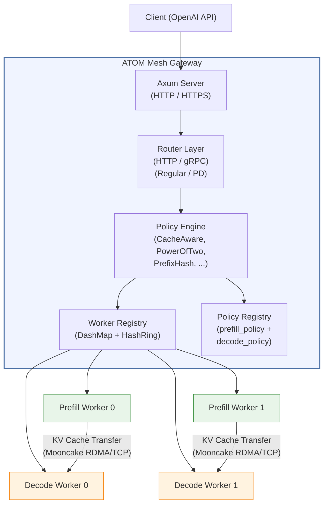
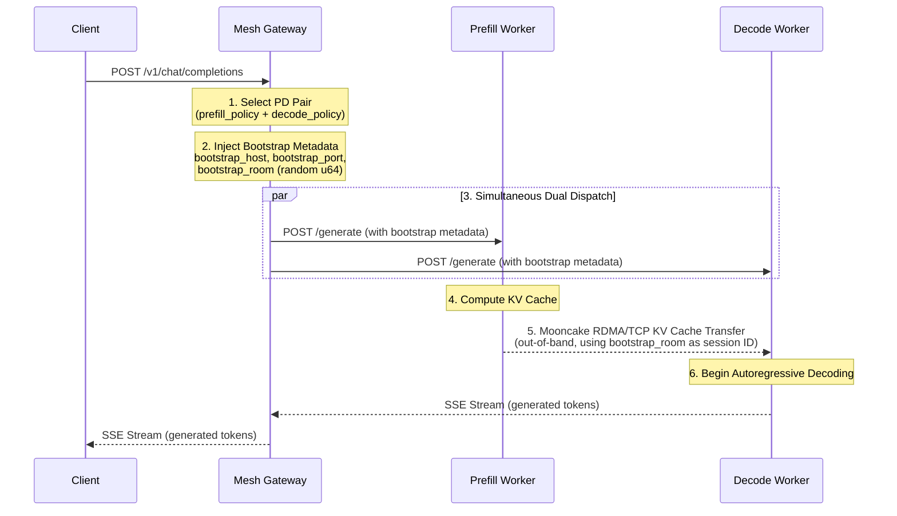
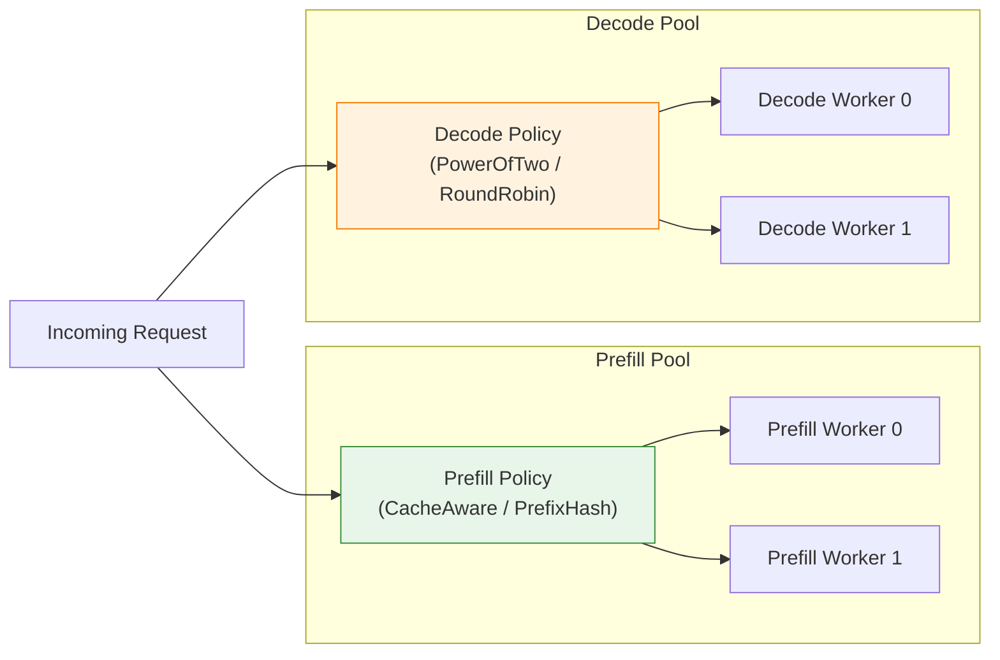

# RFC: ATOM Mesh — High-Performance Model Gateway for Prefill-Decode Disaggregation

---

## 1. Summary

ATOM Mesh is a high-performance model routing gateway written in Rust, purpose-built for **Prefill-Decode (PD) disaggregated LLM inference** on the AMD ROCm platform. It serves as both the control plane and data plane for orchestrating fleets of heterogeneous LLM workers, enabling independent scaling and optimized GPU utilization for the prefill and decode phases of autoregressive inference.

Forked from [sgl-model-gateway v0.3.2](https://github.com/sgl-project/sglang/tree/main/sgl-model-gateway) and extended with PD-specific routing, gRPC pipeline support, cache-aware load balancing, and out-of-band KV cache transfer coordination via the Mooncake Transfer Engine.

---

## 2. Motivation

LLM inference has two phases with opposite compute profiles: **prefill** is compute-bound (parallel matrix ops), while **decode** is memory-bandwidth-bound (sequential token generation). Coupling them on the same GPU wastes resources — prefill bursts starve decode, and decode underutilizes ALUs.

ATOM Mesh solves this by separating them into **independent worker pools** that scale and optimize independently, with KV cache transferred between pools via RDMA/TCP (Mooncake). This is the AMD ROCm counterpart to NVIDIA Dynamo's PD disaggregation.

---

## 3. Architecture Overview



### Component Summary

| Component | Role |
|-----------|------|
| **Axum Server** | HTTP/HTTPS entry point, OpenAI-compatible API endpoints |
| **Router Layer** | HTTP and gRPC routers for Regular and PD modes |
| **Policy Engine** | Load balancing algorithms (CacheAware, PowerOfTwo, PrefixHash, etc.) |
| **Worker Registry** | Live worker state, health tracking, consistent hash ring |
| **Policy Registry** | Model-to-policy mappings; separate prefill/decode policy slots |
| **Circuit Breaker** | Per-worker failure detection with automatic recovery |
| **Retry Executor** | Exponential backoff retry with worker re-selection |
| **Observability** | Prometheus metrics, structured logging |

---

## 4. PD Disaggregation Design

### 4.1 Routing Mode Configuration

The gateway supports two routing modes:

```rust
pub enum RoutingMode {
    // All workers are equivalent
    Regular { worker_urls: Vec<String> },

    // Separate prefill and decode worker pools
    PrefillDecode {
        prefill_urls: Vec<(String, Option<u16>)>,  // URL + optional bootstrap port
        decode_urls: Vec<String>,
        prefill_policy: Option<PolicyConfig>,       // Independent policy for prefill
        decode_policy: Option<PolicyConfig>,         // Independent policy for decode
    },
}
```

CLI usage:

```bash
mesh launch --pd-disaggregation \
    --prefill http://prefill-0:30000 8998 \
    --prefill http://prefill-1:30000 8998 \
    --decode  http://decode-0:30000 \
    --decode  http://decode-1:30000 \
    --prefill-policy cache_aware \
    --decode-policy  power_of_two
```

### 4.2 Request Lifecycle in PD Mode



**Step-by-step:**

1. **Worker Pair Selection** — The prefill policy selects a prefill worker, and the decode policy independently selects a decode worker. Each policy runs against its respective worker pool filtered by health and circuit breaker state.

2. **Bootstrap Metadata Injection** — The gateway injects three fields into the request body:
   - `bootstrap_host` — The prefill worker's address (where Mooncake listens)
   - `bootstrap_port` — The Mooncake transfer engine port (default 8998)
   - `bootstrap_room` — A random u64 session ID in `[0, 2^63)` to isolate concurrent transfers

3. **Simultaneous Dual Dispatch** — Both workers receive the annotated request **at the same time** via `tokio::join!()`. The decode worker can prepare internal state while waiting for the KV cache, avoiding sequential latency. The KV cache transfer happens **out-of-band** — the gateway never touches KV cache bytes (which can be hundreds of MB).

4. **Prefill Computation** — The prefill worker processes the input prompt and computes the KV cache.

5. **KV Cache Transfer** — The Mooncake Transfer Engine transfers the KV cache from prefill to decode via RDMA or TCP. The `bootstrap_room` ensures concurrent requests to the same prefill worker do not collide.

6. **Decode Generation** — The decode worker receives the KV cache and begins autoregressive token generation, streaming results back through the gateway to the client.

---

## 5. Load Balancing Policies

PD disaggregation allows **independent policies** for prefill and decode pools, reflecting their different optimization targets:



| Policy | Best For | Algorithm |
|--------|----------|-----------|
| **CacheAware** | Prefill | Radix tree prefix matching to maximize KV cache hit rate; falls back to load balancing on imbalance. |
| **PowerOfTwo** | Decode | Samples 2 random workers, picks the lower-loaded one. |
| **PrefixHash** | Prefill (lightweight) | Hashes the first N tokens to a consistent hash ring. O(log n) lookup. |
| **RoundRobin** | Baseline | Atomic counter-based sequential selection. |
| **Random** | Baseline | Uniform random selection. |

---

## 6. Source Tree

119 source files organized into 6 layers: entry, config, core, policies, routers, and observability.

### 6.1 Entry Point & Top-Level Modules

| File | Description |
|------|-------------|
| `main.rs` | CLI entry point: ~50 clap parameters, converts to `RouterConfig` + `ServerConfig` |
| `lib.rs` | Crate root: exports all modules + 4 external crate re-exports (`protocols`, `reasoning_parser`, `tokenizer`, `tool_parser`) |
| `server.rs` | Axum HTTP server: route assembly, middleware stacking, ~30 handlers, startup sequence (worker registration, tokenizer loading, etc.) |
| `app_context.rs` | Dependency container (`AppContext`): HTTP client, config, registries, storage, rate limiter, etc. Builder pattern + `OnceLock` |
| `middleware.rs` | Middleware: `RequestId` / `HttpMetrics` / `TokenBucket` rate limiting / `TokenGuardBody` (defers token return until response stream completes) |
| `version.rs` | Compile-time version constants (git commit/branch/rustc) + formatters |

### 6.2 Configuration Layer (`config/`)

| File | Description |
|------|-------------|
| `mod.rs` | Module root + `ConfigError` / `ConfigResult` definitions |
| `types.rs` | `RouterConfig`, `RoutingMode`, `PolicyConfig`, `RetryConfig`, `CircuitBreakerConfig`, `HealthCheckConfig`, `TokenizerCacheConfig`, etc. |
| `builder.rs` | `RouterConfigBuilder`: fluent API with sensible defaults |
| `validation.rs` | `ConfigValidator`: pre-startup constraint checks across all config sections |

### 6.3 Core Abstraction Layer (`core/`)

Worker lifecycle management, reliability primitives, and workflow orchestration.

| File | Description |
|------|-------------|
| `mod.rs` | Module root + commonly-used type re-exports |
| `worker.rs` | `Worker` trait + `BasicWorker` + `DPAwareWorker`: health state, load counting, routing key, connection mode |
| `worker_builder.rs` | `BasicWorkerBuilder` / `DPAwareWorkerBuilder`: fluent constructors with circuit breaker config injection |
| `worker_registry.rs` | `WorkerRegistry`: `DashMap` storage + model index + `HashRing` consistent hashing (150 virtual nodes, blake3) |
| `worker_service.rs` | `WorkerService`: Worker CRUD business logic, decoupled from HTTP handlers |
| `worker_manager.rs` | `WorkerManager`: fan-out operations (`flush_cache` / `get_loads` / `get_metrics`) + `LoadMonitor` for periodic sampling |
| `circuit_breaker.rs` | Circuit breaker: Closed -> Open -> HalfOpen state machine, configurable failure/success thresholds and timeout windows |
| `retry.rs` | Retry executor: exponential backoff + jitter calculation + HTTP status code retryability classification |
| `job_queue.rs` | Async job queue: mpsc + Semaphore, dispatches Worker/Tokenizer add/remove/update jobs to workflow engines |
| `token_bucket.rs` | Token bucket rate limiter: smooth refill + burst capacity + `Notify`-based async fair queuing (`parking_lot::Mutex`) |
| `metrics_aggregator.rs` | Multi-worker Prometheus metrics aggregation: scrape + deduplicate + merge |
| `error.rs` | `WorkerError` enum (health check failure / network / capacity / config) + `WorkerResult<T>` type alias |

#### 6.3.1 Workflow Steps (`core/steps/`)

Driven by the `wfaas` DAG workflow engine.

| File | Description |
|------|-------------|
| `mod.rs` | Step module root |
| `workflow_data.rs` | Strongly-typed workflow data structs: `LocalWorkerData` / `RemovalData` / `UpdateData` / `TokenizerData` |
| `workflow_engines.rs` | 4 typed engine aliases: registration / removal / update / tokenizer |
| `tokenizer_registration.rs` | Tokenizer loading step: local path or HuggingFace download with validation, caching, and deduplication |

#### 6.3.2 Local Worker Steps (`core/steps/worker/local/`)

Steps specific to CLI-declared workers.

| File | Description |
|------|-------------|
| `mod.rs` | Aggregated exports + URL protocol-stripping utility |
| `create_worker.rs` | Merge config + discovered metadata -> Worker objects (basic or DP-aware) |
| `detect_connection.rs` | Probe worker endpoint to determine connection mode (HTTP health check vs gRPC reflection) |
| `discover_dp.rs` | Query `/server_info` for `dp_size` and `model_id` |
| `discover_metadata.rs` | Fetch worker metadata (labels, model info) via HTTP or gRPC `server_info` |
| `find_worker_to_update.rs` | Lookup registered workers by URL for update operations |
| `find_workers_to_remove.rs` | Match workers by URL for removal candidates |
| `update_worker_properties.rs` | Rebuild Worker with new config, replace in registry |
| `update_policies_for_worker.rs` | Re-init routing policies for affected models after worker property changes |
| `update_remaining_policies.rs` | Rebuild cache-aware policies using remaining workers after removal |
| `submit_tokenizer_job.rs` | Enqueue `AddTokenizer` async job to `JobQueue` |
| `remove_from_policy_registry.rs` | Remove worker from policy registry + notify departure |
| `remove_from_worker_registry.rs` | Delete from worker registry + emit removal metrics |

#### 6.3.3 Shared Worker Steps (`core/steps/worker/shared/`)

Reused by both local and external worker registration workflows.

| File | Description |
|------|-------------|
| `mod.rs` | Exports + `WorkerList` type alias |
| `register.rs` | `RegisterWorkersStep`: write to registry + update `pool_size` Prometheus gauge |
| `update_policies.rs` | `UpdatePoliciesStep`: notify policy registry + init cache-aware policies + PD conflict detection |
| `activate.rs` | `ActivateWorkersStep`: mark workers healthy, begin accepting traffic |

### 6.4 Load Balancing Policy Layer (`policies/`)

| File | Description |
|------|-------------|
| `mod.rs` | `LoadBalancingPolicy` trait definition + module re-exports |
| `random.rs` | `RandomPolicy`: uniform random selection among healthy workers |
| `round_robin.rs` | `RoundRobinPolicy`: atomic counter sequential rotation |
| `cache_aware.rs` | `CacheAwarePolicy`: radix tree prefix matching for KV cache locality, falls back to shortest-queue on load imbalance |
| `power_of_two.rs` | `PowerOfTwoPolicy`: pick 2 random workers, route to lighter-loaded one |
| `prefix_hash.rs` | `PrefixHashPolicy`: consistent hash ring on first N tokens + load-factor bounded fallback |
| `registry.rs` | `PolicyRegistry`: dynamic model -> policy mapping with separate prefill/decode policy slots for PD mode |
| `factory.rs` | `PolicyFactory`: create concrete policy instances from `PolicyConfig` enum |
| `tree.rs` | Concurrent approximate radix tree (`DashMap`-backed), serves `CacheAwarePolicy` prefix matching |
| `utils.rs` | `PeriodicTask`: background thread with shutdown flag for recurring maintenance (e.g., tree eviction) |

### 6.5 Router Layer (`routers/`)

Request forwarding to workers. 4 router implementations: `HttpRouter`, `HttpPdRouter`, `GrpcRouter`, `GrpcPdRouter`.

| File | Description |
|------|-------------|
| `mod.rs` | `RouterTrait` definition: `route_chat` / `route_generate` / `route_responses` / `route_completion` / `get_models`, etc. |
| `factory.rs` | `RouterFactory`: `connection_mode` x `routing_mode` -> concrete router instance |
| `router_manager.rs` | `RouterManager`: router coordination + request dispatch |
| `error.rs` | Structured error responses (400/404/500 + `X-Mesh-Error-Code` header) |
| `header_utils.rs` | Request/response header forwarding + hop-by-hop filtering |
| `persistence_utils.rs` | Response/Conversation serialization and persistence utilities |

#### 6.5.1 HTTP Router (`routers/http/`)

| File | Description |
|------|-------------|
| `mod.rs` | Module exports |
| `router.rs` | `HttpRouter`: `select_worker` -> `reqwest` forward -> SSE stream + retry |
| `pd_router.rs` | `HttpPdRouter`: select prefill + decode workers -> dual-dispatch with bootstrap metadata injection |
| `pd_types.rs` | PD-specific error types + URL construction utilities |

#### 6.5.2 gRPC Router (`routers/grpc/`)

| File | Description |
|------|-------------|
| `mod.rs` | Module exports + `ProcessedMessages` type |
| `router.rs` | `GrpcRouter`: pipeline orchestration with retry support |
| `pd_router.rs` | `GrpcPdRouter`: prefill/decode dual-dispatch pipeline |
| `client.rs` | Polymorphic gRPC client: wraps SGLang/vLLM backends behind unified interface |
| `pipeline.rs` | `RequestPipeline`: sequences stages (prep -> build -> execute -> process) |
| `context.rs` | `RequestContext` / `SharedComponents`: carries request state through all pipeline stages |
| `proto_wrapper.rs` | Unified protobuf request/response/stream enum wrappers |
| `utils.rs` | Stream collection, logprob formatting, tool-call parsing, error type mapping |

**Shared gRPC components (`routers/grpc/common/`):**

| File | Description |
|------|-------------|
| `response_collection.rs` | Collect and merge gRPC stream responses (single-path and PD dual-path) |
| `response_formatting.rs` | Aggregate `Usage` token counts from completions |
| `responses/context.rs` | `ResponsesContext`: pipeline + storage + shared components for `/v1/responses` |
| `responses/handlers.rs` | GET / Cancel handlers for `/v1/responses/{id}` |
| `responses/streaming.rs` | SSE stream: chat completion events -> responses event format conversion |
| `responses/utils.rs` | Tool extraction + response persistence helpers |

**Shared pipeline stages (`routers/grpc/common/stages/`):**

| File | Description |
|------|-------------|
| `mod.rs` | `PipelineStage` trait + exports 4 shared stages |
| `worker_selection.rs` | Select worker: regular picks 1 / PD picks prefill + decode pair |
| `client_acquisition.rs` | Acquire gRPC client handle from selected worker |
| `dispatch_metadata.rs` | Build routing metadata (model_id, timestamps) |
| `request_execution.rs` | Execute gRPC generate request (single-path or PD dual-dispatch) |
| `helpers.rs` | Inject PD bootstrap metadata (host / port / room_id) into request |

**Regular mode (`routers/grpc/regular/`):**

| File | Description |
|------|-------------|
| `processor.rs` | Response processor: collect gRPC stream -> chat/generate response types |
| `streaming.rs` | Streaming processor: gRPC token stream -> SSE chat/generate completion events |
| `responses/common.rs` | Load conversation history + prior response chains |
| `responses/conversions.rs` | `ResponsesRequest` <-> `ChatCompletionRequest` conversion |
| `responses/handlers.rs` | `POST /v1/responses` entry: dispatch streaming / non-streaming |
| `responses/non_streaming.rs` | Non-streaming: load history -> pipeline -> convert -> persist |
| `responses/streaming.rs` | Streaming: chat SSE -> responses events -> persist |

**Regular pipeline stages (`routers/grpc/regular/stages/`):**

| File | Description |
|------|-------------|
| `preparation.rs` | Dispatcher: delegates to chat or generate preparation |
| `request_building.rs` | Dispatcher: delegates proto request construction |
| `response_processing.rs` | Dispatcher: delegates response handling |
| `chat/preparation.rs` | Filter tools, process messages, tokenize input, build generation constraints |
| `chat/request_building.rs` | Build chat proto `GenerateRequest` (+ PD metadata injection) |
| `chat/response_processing.rs` | Streaming -> SSE / non-streaming -> `ChatCompletionResponse` |
| `generate/preparation.rs` | Resolve `input_ids`, tokenize text, create stop-sequence decoder |
| `generate/request_building.rs` | Build generate proto `GenerateRequest` (+ PD metadata injection) |
| `generate/response_processing.rs` | Streaming / non-streaming -> `GenerateResponse` |

#### 6.5.3 Auxiliary Routers

| File | Description |
|------|-------------|
| `conversations/handlers.rs` | `/v1/conversations` API: CRUD handlers for conversation items |
| `parse/handlers.rs` | Function-call JSON parsing + reasoning text separation |
| `tokenize/handlers.rs` | Tokenize / detokenize + tokenizer lifecycle management (add / list / get / remove) |

### 6.6 Observability Layer (`observability/`)

| File | Description |
|------|-------------|
| `mod.rs` | Module exports |
| `metrics.rs` | Prometheus metrics: string interning for low-allocation labels, counters / gauges / histograms definition and export |
| `events.rs` | Request events: `RequestSentEvent` / `RequestPDSentEvent`, structured tracing debug logs |
| `inflight_tracker.rs` | In-flight request tracker: track by ID + age-bucketed gauge histogram for Grafana heatmap |
| `gauge_histogram.rs` | Non-cumulative gauge histogram: pre-registered handles for zero-allocation hot path, Grafana heatmap compatible |
| `logging.rs` | `tracing-subscriber` config: non-blocking rolling file sink + JSON format + colorized console + UTC timestamps |
