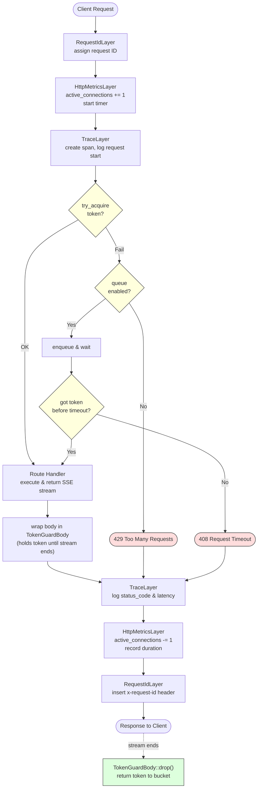

# Middleware Flow: Streaming Request Lifecycle

A streaming `POST /v1/chat/completions` request through all middleware layers.

```mermaid
flowchart TD
    C([Client Request]) --> RID_PRE["RequestIdLayer<br/>assign request ID"]
    RID_PRE --> MET_PRE["HttpMetricsLayer<br/>active_connections += 1<br/>start timer"]
    MET_PRE --> TRC_PRE["TraceLayer<br/>create span, log request start"]
    TRC_PRE --> TRY{"try_acquire<br/>token?"}

    TRY -->|OK| HANDLER
    TRY -->|Fail| HAS_Q{"queue<br/>enabled?"}

    HAS_Q -->|No| R429([429 Too Many Requests])
    HAS_Q -->|Yes| ENQUEUE[enqueue & wait]
    ENQUEUE --> WAIT{"got token<br/>before timeout?"}
    WAIT -->|Yes| HANDLER
    WAIT -->|No| R408([408 Request Timeout])

    HANDLER["Route Handler<br/>execute & return SSE stream"] --> WRAP["wrap body in TokenGuardBody<br/>(holds token until stream ends)"]

    WRAP --> TRC_POST["TraceLayer<br/>log status_code & latency"]
    R429 --> TRC_POST
    R408 --> TRC_POST
    TRC_POST --> MET_POST["HttpMetricsLayer<br/>active_connections -= 1<br/>record duration"]
    MET_POST --> RID_POST["RequestIdLayer<br/>insert x-request-id header"]
    RID_POST --> RESP([Response to Client])

    RESP -.->|"stream ends"| DROP["TokenGuardBody::drop()<br/>return token to bucket"]

    style TRY fill:#ffd,stroke:#333
    style HAS_Q fill:#ffd,stroke:#333
    style WAIT fill:#ffd,stroke:#333
    style DROP fill:#dfd,stroke:#333
    style R429 fill:#fdd,stroke:#333
    style R408 fill:#fdd,stroke:#333
```
