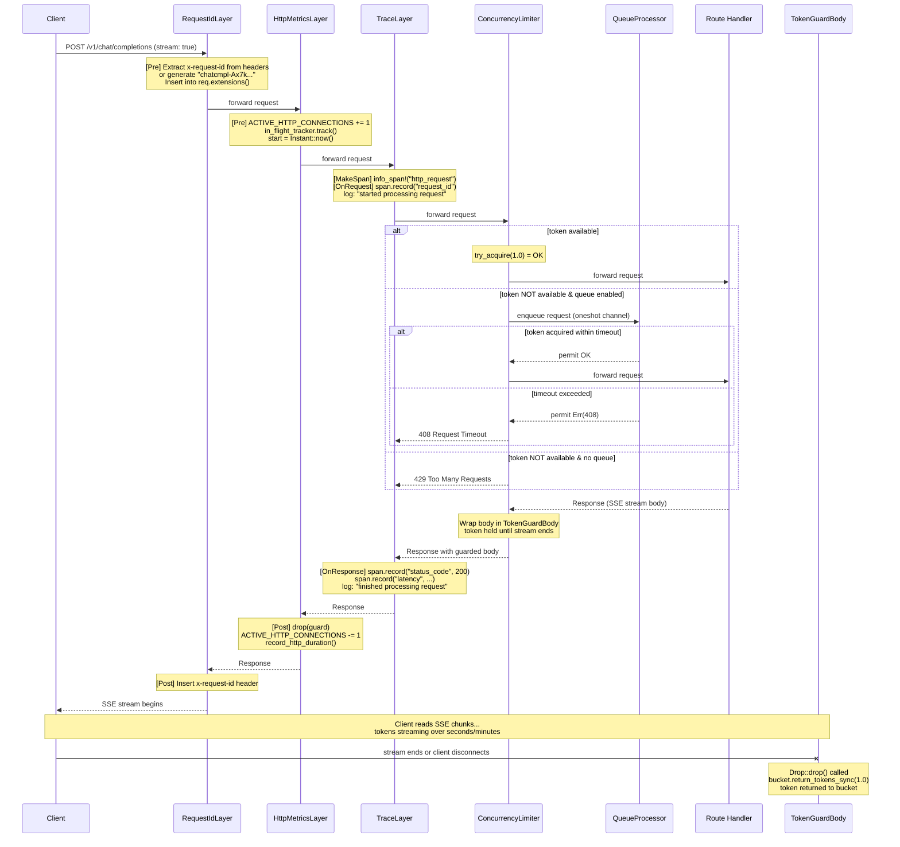
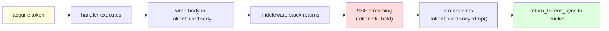

# Middleware Flow: Streaming Request Lifecycle

A streaming `POST /v1/chat/completions` request through all middleware layers.

## Request Flow (Onion Model)

## Token Lifecycle in Streaming

## Middleware Layer Order

Axum `.layer()` uses an onion model: **last added = outermost = executes first**.

```mermaid
graph TB
    subgraph "build_app() layer order (server.rs)"
        L1[".layer(RequestIdLayer)  — added last"]
        L2[".layer(HttpMetricsLayer)"]
        L3[".layer(create_logging_layer)"]
        L4[".layer(RequestBodyLimitLayer)"]
        L5[".route_layer(concurrency_limit_middleware)<br/>only on protected routes"]
        L6["Route Handler"]
    end

    L1 -->|"request ↓"| L2
    L2 -->|"request ↓"| L3
    L3 -->|"request ↓"| L4
    L4 -->|"request ↓"| L5
    L5 -->|"request ↓"| L6
    L6 -->|"response ↑"| L5
    L5 -->|"response ↑"| L4
    L4 -->|"response ↑"| L3
    L3 -->|"response ↑"| L2
    L2 -->|"response ↑"| L1

    style L1 fill:#ddf
    style L5 fill:#ffd
    style L6 fill:#dfd
```

> **Note**: `concurrency_limit_middleware` is a `.route_layer()` applied only to inference
> endpoints (`/v1/chat/completions`, `/v1/completions`, `/generate`, `/v1/responses`).
> Health checks, model listing, and admin routes bypass concurrency limiting.
