# Three-Layer Architecture Design

Entrypoints / Mesh / Worker three-layer decoupled design.

---

## 1. Overall Architecture

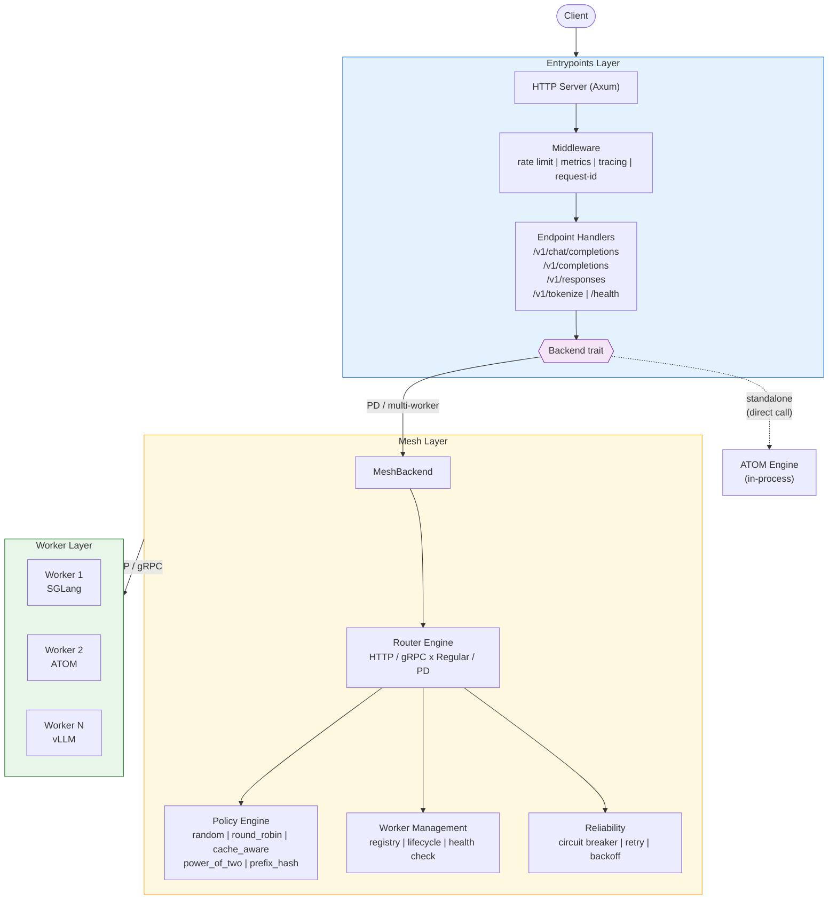

---

## 2. Standalone vs PD Mode Dataflow

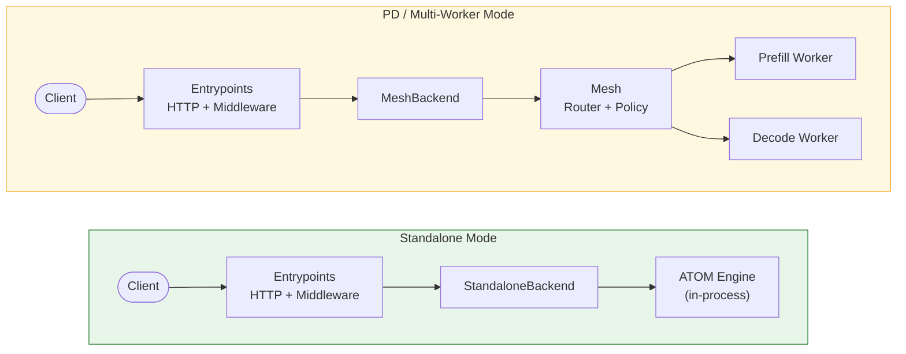

---

## 3. Entrypoints Layer

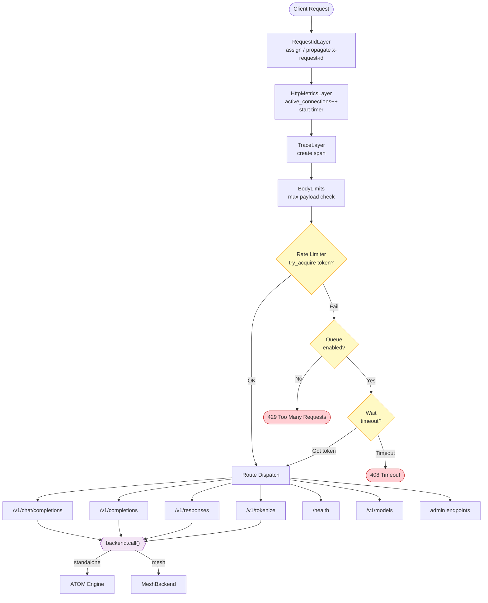

### Entrypoints Layer Features

```mermaid
flowchart LR
    subgraph Middleware ["Middleware Stack"]
        direction TB
        A1["RequestIdLayer"]
        A2["HttpMetricsLayer"]
        A3["TraceLayer"]
        A4["BodyLimits"]
        A5["ConcurrencyLimit + TokenGuardBody"]
    end

    subgraph Endpoints ["Endpoint Handlers"]
        direction TB
        B1["/v1/chat/completions"]
        B2["/v1/completions"]
        B3["/v1/responses"]
        B4["/v1/tokenize"]
        B5["/v1/detokenize"]
        B6["/v1/models"]
        B7["/health + /health/ready"]
        B8["/metrics"]
    end

    subgraph Infra ["Infrastructure"]
        direction TB
        C1["TokenBucket<br/>rate limit + refill"]
        C2["InFlightTracker<br/>request age histogram"]
        C3["Logging<br/>tracing + rolling file"]
        C4["Prometheus<br/>HTTP-level metrics"]
        C5["Error Helpers<br/>structured error responses"]
        C6["Header Utils<br/>forwarding + hop-by-hop filter"]
    end

    subgraph BackendDef ["Backend Trait"]
        direction TB
        D1["chat_completion()"]
        D2["completion()"]
        D3["generate()"]
        D4["tokenize()"]
        D5["health()"]
        D6["models()"]
    end

    Middleware --> Endpoints
    Endpoints --> BackendDef
    Infra -.-> Middleware

    style Middleware fill:#e3f2fd,stroke:#1565c0
    style Endpoints fill:#e3f2fd,stroke:#1565c0
    style Infra fill:#e3f2fd,stroke:#1565c0
    style BackendDef fill:#f3e5f5,stroke:#7b1fa2
```

---

## 4. Mesh Layer

### 4.1 Request Routing Flow

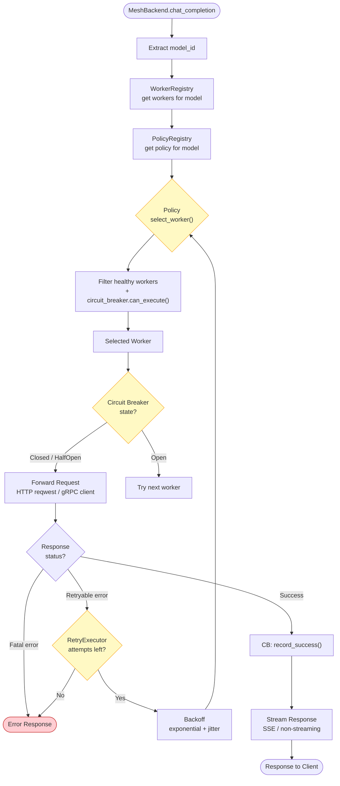

### 4.2 PD Routing Flow

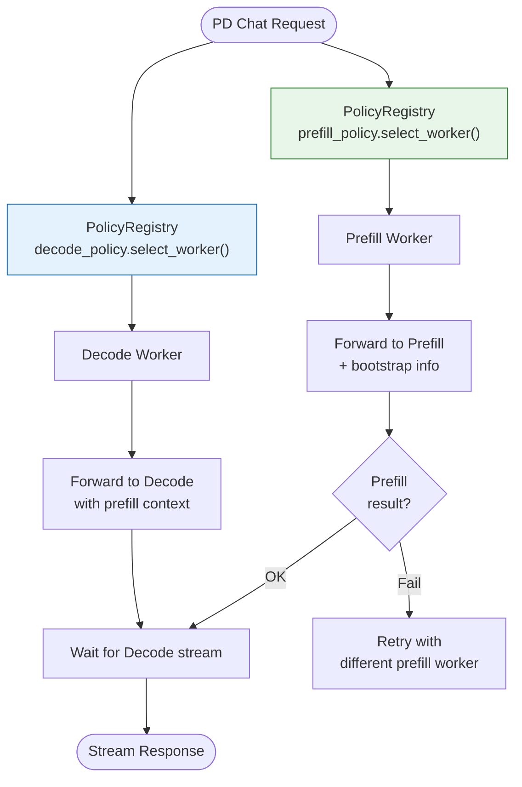

### 4.3 Policy Engine

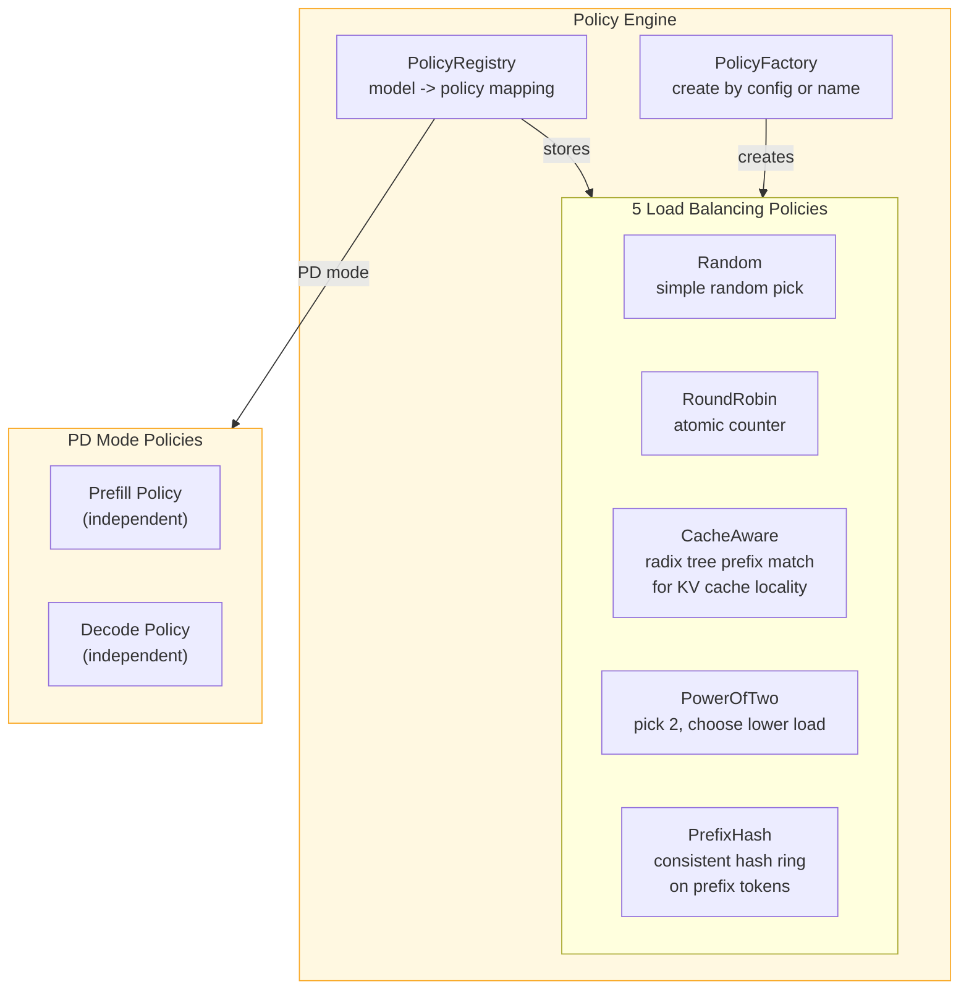

### 4.4 Worker Management

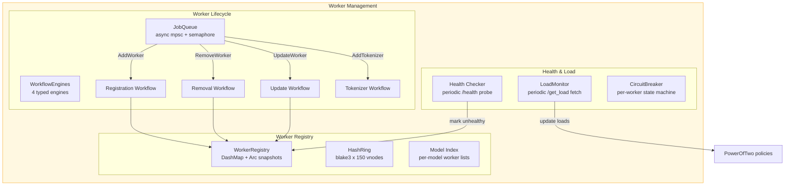

### 4.5 Worker Registration Workflow

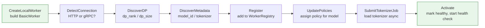

### 4.6 Router Implementations

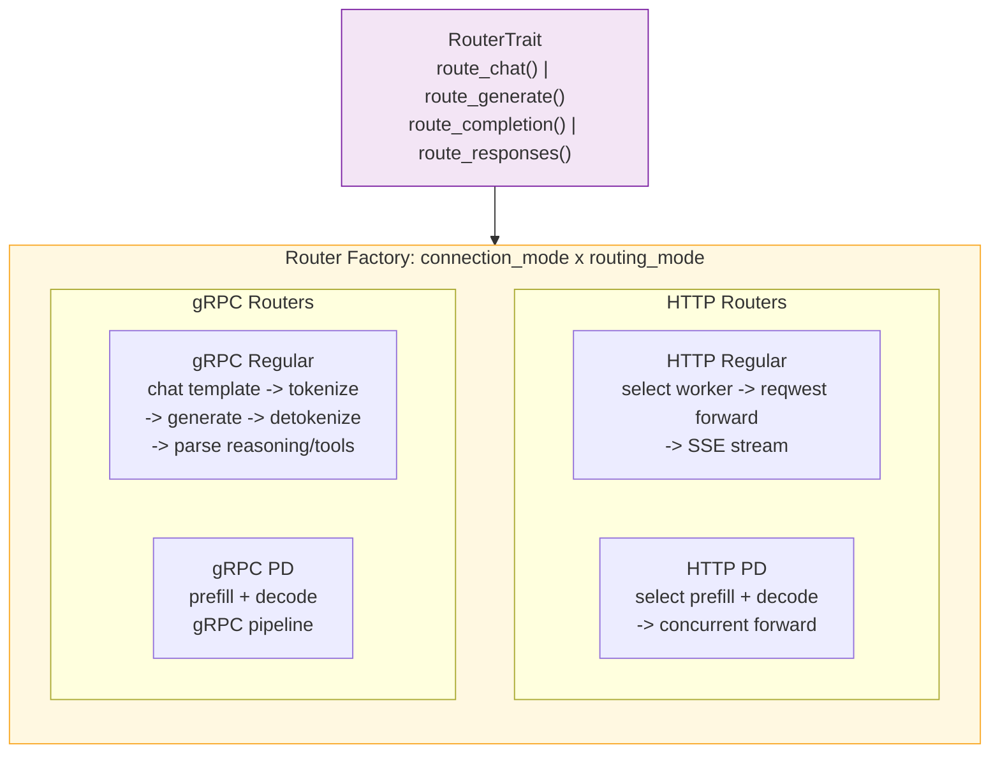

### 4.7 Observability (Mesh-Level)

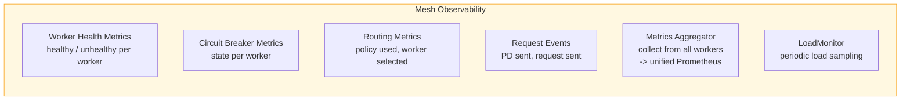

---

## 5. Worker Layer

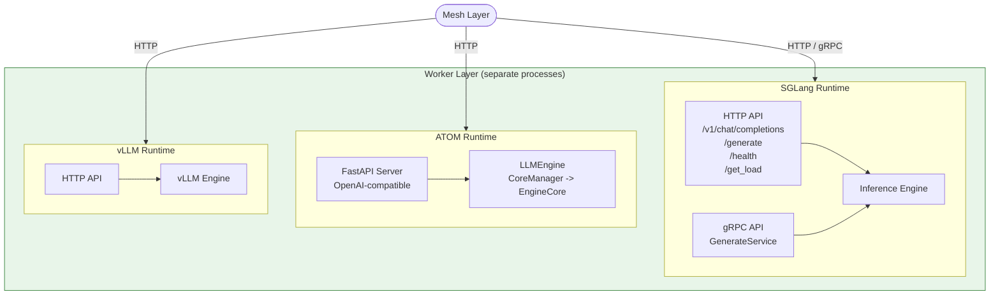

---

## 6. Feature-to-Layer Mapping

```mermaid
flowchart TB
    subgraph EP_Features ["Entrypoints Layer"]
        direction TB
        E1["HTTP Server (Axum)"]
        E2["RequestIdLayer"]
        E3["HttpMetricsLayer"]
        E4["ConcurrencyLimit + TokenGuardBody"]
        E5["TokenBucket"]
        E6["InFlightTracker"]
        E7["Logging"]
        E8["Endpoint Handlers"]
        E9["Error / Header Utils"]
        E10["Backend Trait"]
        E11["Prometheus HTTP Metrics"]
    end

    subgraph MESH_Features ["Mesh Layer"]
        direction TB
        M1["RouterTrait + 4 implementations"]
        M2["RouterFactory + RouterManager"]
        M3["5 Routing Policies + Registry"]
        M4["Worker Trait + Registry + HashRing"]
        M5["WorkerService + WorkerManager"]
        M6["CircuitBreaker + RetryExecutor"]
        M7["JobQueue + WorkflowEngines"]
        M8["8 Workflow Steps"]
        M9["LoadMonitor"]
        M10["MetricsAggregator"]
        M11["gRPC Client + Pipeline"]
        M12["AppContext"]
        M13["RouterConfig + PolicyConfig"]
    end

    subgraph SHARED_Features ["Shared / Cross-Layer"]
        direction TB
        S1["Tokenizer Registry + Handlers"]
        S2["Conversations API + Storage"]
        S3["Parse Handlers (reasoning / tools)"]
        S4["Response Storage"]
        S5["Protocol Types (openai_protocol)"]
    end

    subgraph WORKER_Features ["Worker Layer"]
        direction TB
        W1["SGLang Server"]
        W2["ATOM Engine"]
        W3["vLLM Server"]
    end

    style EP_Features fill:#e3f2fd,stroke:#1565c0
    style MESH_Features fill:#fff8e1,stroke:#f9a825
    style SHARED_Features fill:#f3e5f5,stroke:#7b1fa2
    style WORKER_Features fill:#e8f5e9,stroke:#2e7d32
```

---

## 7. Backend Trait Design

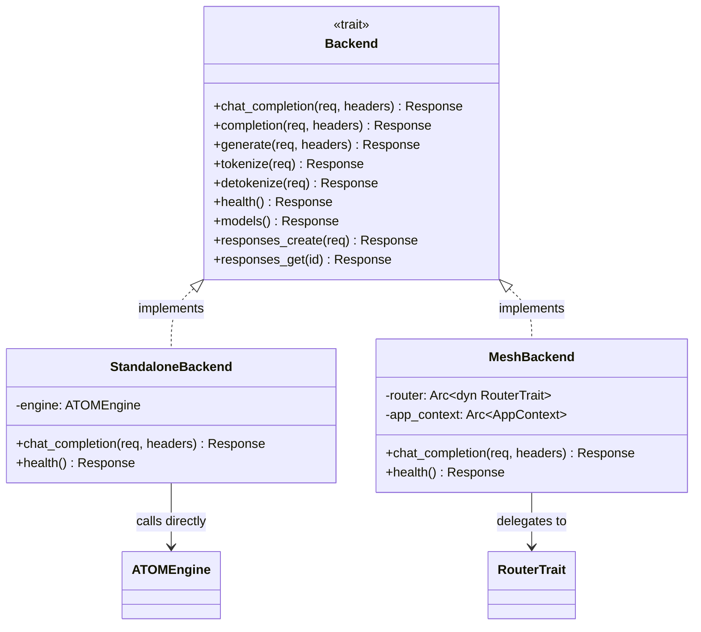

---

## 8. Migration Phases

```mermaid
flowchart LR
    subgraph Phase1 ["Phase 1: Extract Middleware"]
        direction TB
        P1A["Move TokenBucket to shared crate"]
        P1B["Move RequestId / HttpMetrics / TraceLayer"]
        P1C["Move InFlightTracker + Logging"]
        P1D["Move Error / Header Utils"]
    end

    subgraph Phase2 ["Phase 2: Define Backend Trait"]
        direction TB
        P2A["Define Backend trait in entrypoints"]
        P2B["Implement MeshBackend wrapping RouterTrait"]
        P2C["Implement StandaloneBackend for ATOM"]
    end

    subgraph Phase3 ["Phase 3: Split Server"]
        direction TB
        P3A["Move endpoint handlers to entrypoints"]
        P3B["Move build_app() to entrypoints"]
        P3C["AppState holds Arc dyn Backend"]
        P3D["Mesh becomes library, not binary"]
    end

    subgraph Phase4 ["Phase 4: Clean Boundary"]
        direction TB
        P4A["Mesh exposes MeshBackend::new()"]
        P4B["Remove HTTP server code from mesh"]
        P4C["Entrypoints chooses backend by mode"]
    end

    Phase1 --> Phase2 --> Phase3 --> Phase4

    style Phase1 fill:#e3f2fd,stroke:#1565c0
    style Phase2 fill:#f3e5f5,stroke:#7b1fa2
    style Phase3 fill:#fff8e1,stroke:#f9a825
    style Phase4 fill:#e8f5e9,stroke:#2e7d32
```

---

## 9. Target Crate Structure

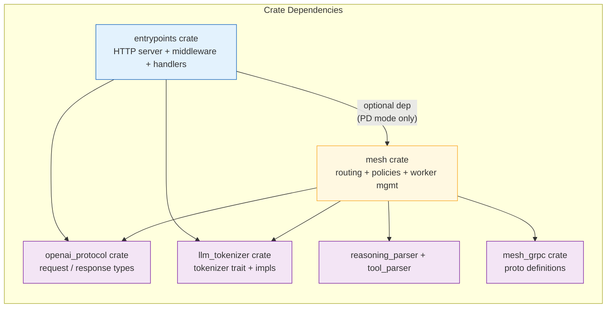
