# Worker 子系统设计

Worker 子系统是 ATOM Mesh 的核心模块，负责后端推理服务的抽象、注册、管理和运维。本文档通过 Mermaid 图详细介绍整个 Worker 子系统的设计原理。

---

## 1. 整体架构总览

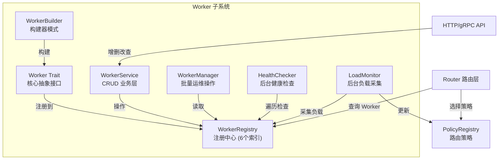

---

## 2. Worker Trait 与两种实现

Worker Trait 定义了 ~30 个方法，是所有后端服务的统一抽象。有两种实现：

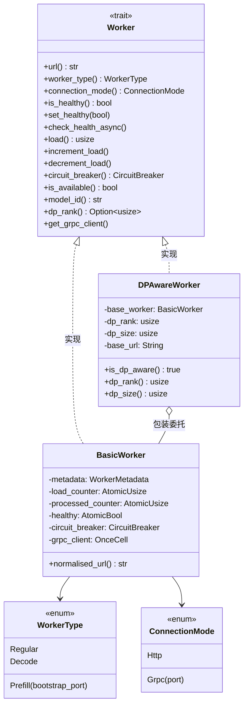

**关键设计**：
- `BasicWorker` 使用 `AtomicUsize` / `AtomicBool` 实现无锁计数器，高并发下零竞争
- `DPAwareWorker` 包装 `BasicWorker`，URL 格式为 `base_url@dp_rank`，用于数据并行路由
- `CircuitBreaker` 实现熔断保护，防止故障 Worker 拖垮整个系统

---

## 3. WorkerBuilder 构建流程

使用 Builder 模式创建 Worker，避免构造函数参数过多：

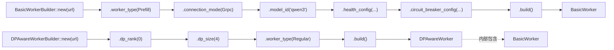

---

## 4. WorkerRegistry 六索引设计

WorkerRegistry 是 Worker 子系统的核心数据结构，维护 6 个 `DashMap` 索引实现多维度 O(1) 查询：

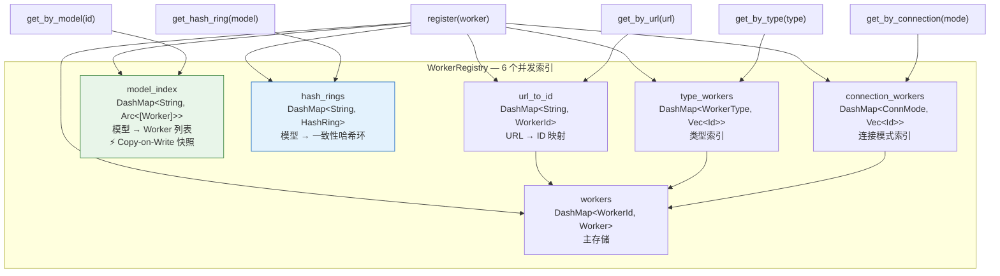

---

## 5. Copy-on-Write 模型索引（热路径优化）

`model_index` 是请求路由的热路径，使用 `Arc<[Arc<dyn Worker>]>` 不可变快照实现无锁读取：

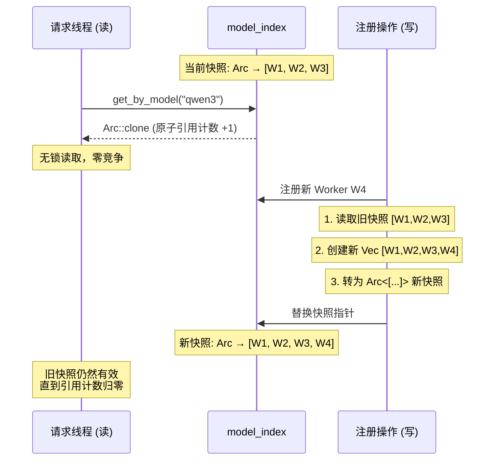

---

## 6. 一致性哈希环 (HashRing)

每个模型维护一个 HashRing，用于 ConsistentHash 策略的 O(log n) Worker 选择：

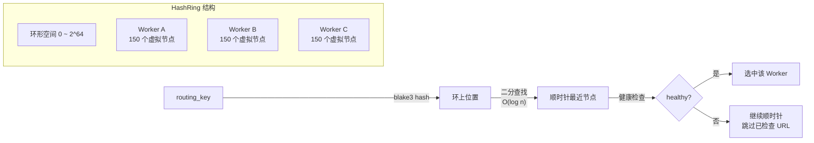

**设计要点**：
- 每个 Worker 150 个虚拟节点，保证均匀分布
- blake3 哈希，跨 Rust 版本稳定
- 增删 Worker 时只有 ~1/N 的 key 需要重新分配

---

## 7. WorkerService CRUD 操作

WorkerService 是 HTTP API 和 WorkerRegistry 之间的业务逻辑层，所有写操作通过 JobQueue 异步执行：

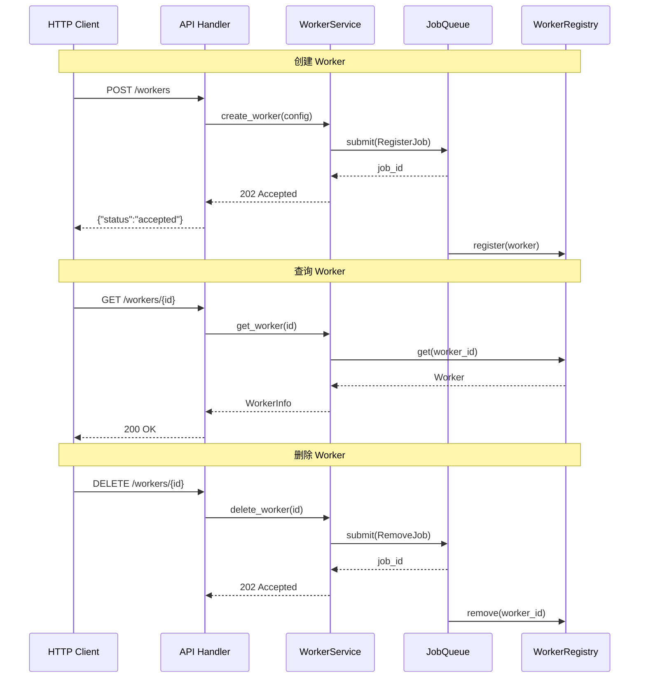

---

## 8. WorkerManager 批量运维

WorkerManager 提供静态方法，对所有 Worker 进行并行批量操作（fan-out 模式）：

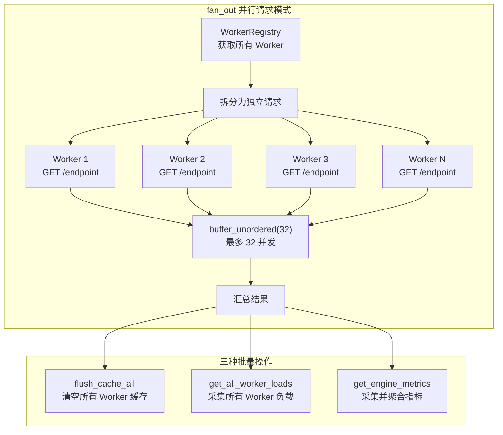

---

## 9. 两个后台任务：HealthChecker & LoadMonitor

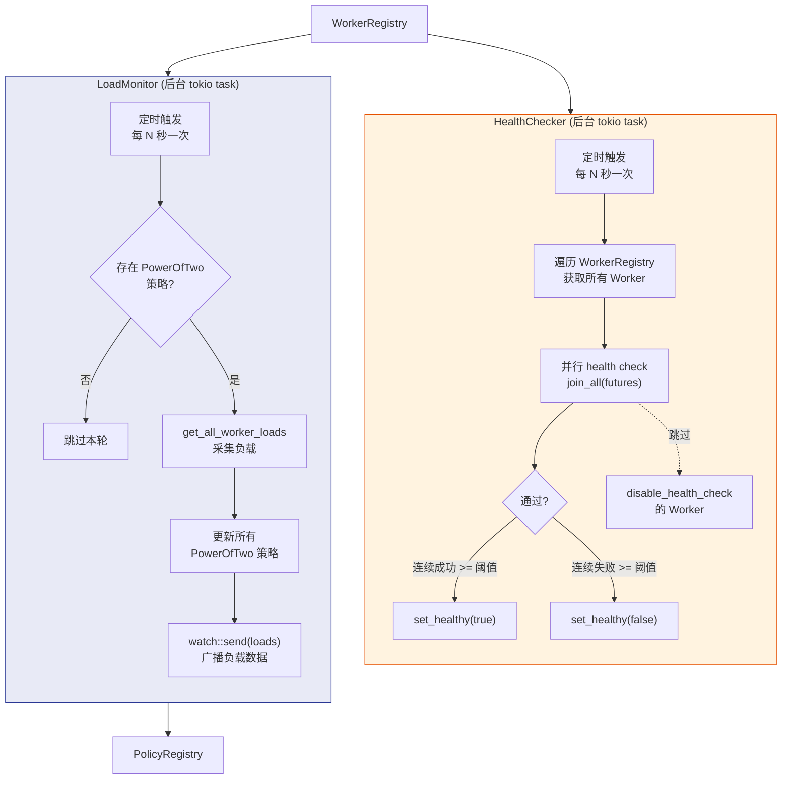

---

## 10. 请求处理完整流程

一个请求从进入到选中 Worker 的完整路径：

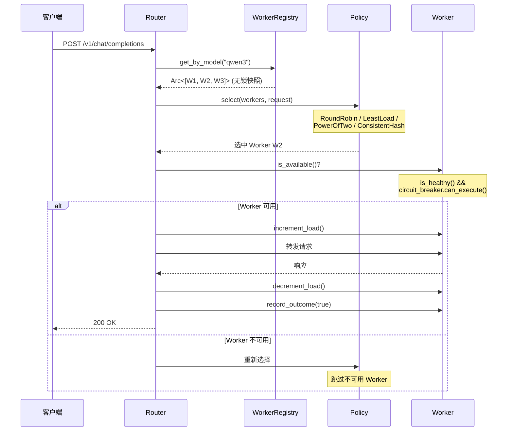

---

## 11. 组件间关系总图

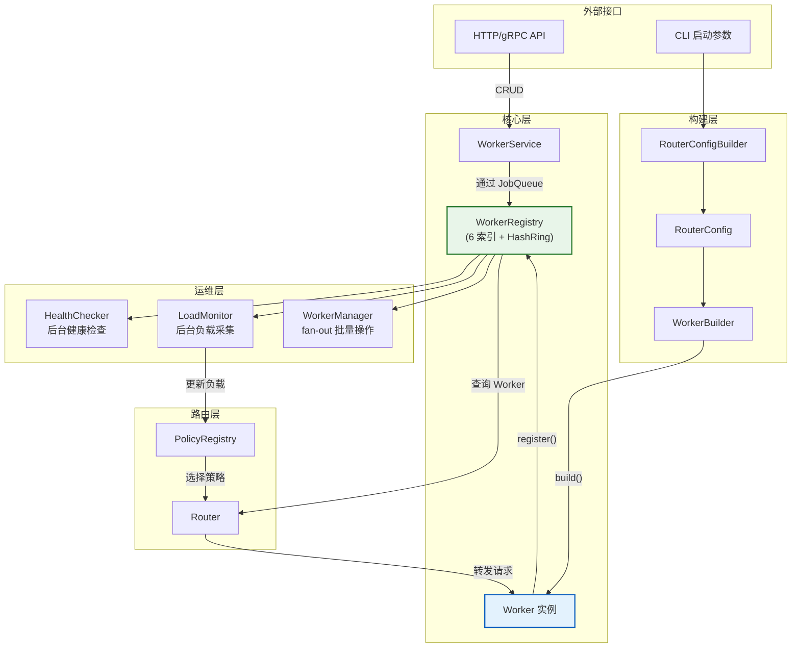

---

## 关键设计总结

| 组件 | 职责 | 核心技术 |
|------|------|----------|
| **Worker Trait** | 后端服务统一抽象 | async_trait, ~30 方法 |
| **BasicWorker** | 标准实现 | AtomicUsize/AtomicBool 无锁计数 |
| **DPAwareWorker** | 数据并行路由 | 包装委托 + `url@rank` 格式 |
| **WorkerBuilder** | 流式构建 Worker | Builder 模式，14+ 可配置字段 |
| **WorkerRegistry** | 多维索引注册中心 | 6 个 DashMap + Copy-on-Write 快照 |
| **HashRing** | 一致性哈希 | blake3 + 150 虚拟节点 + O(log n) 查找 |
| **WorkerService** | CRUD 业务逻辑 | JobQueue 异步写 + 同步读 |
| **WorkerManager** | 批量运维操作 | fan_out + buffer_unordered(32) |
| **HealthChecker** | 后台健康巡检 | tokio::spawn + join_all 并行检查 |
| **LoadMonitor** | 后台负载采集 | watch channel 广播 + 仅更新 PowerOfTwo |
