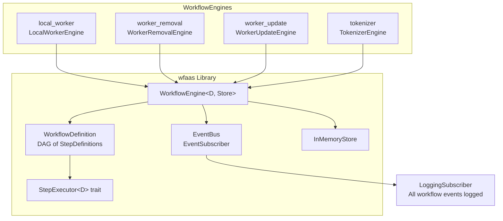
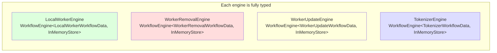
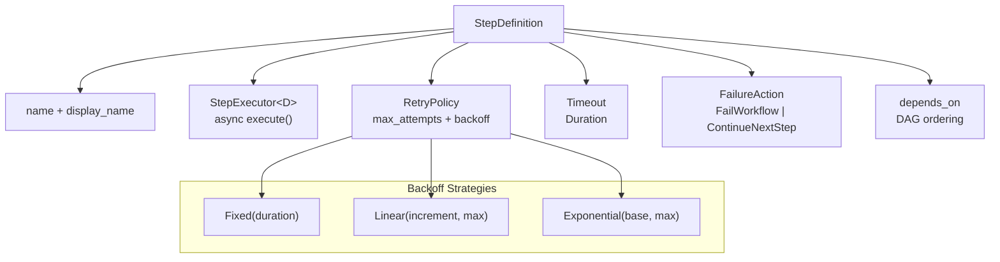
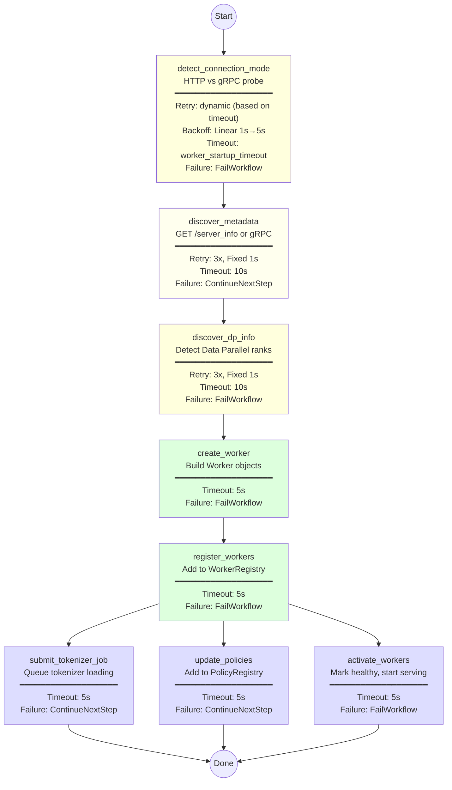
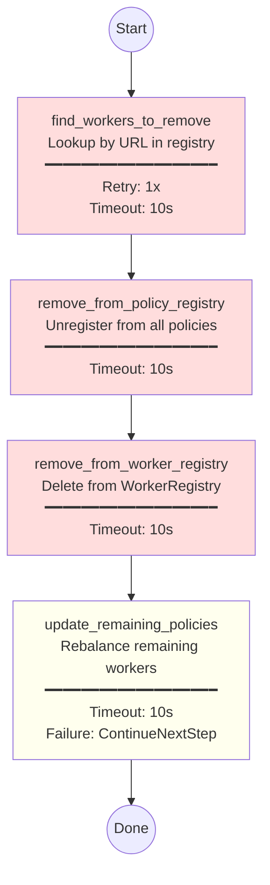
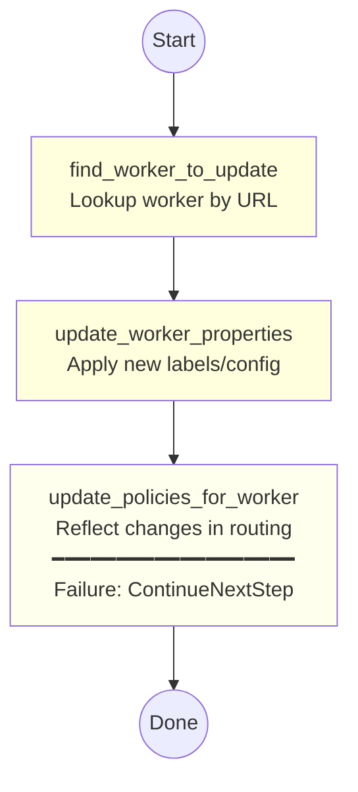
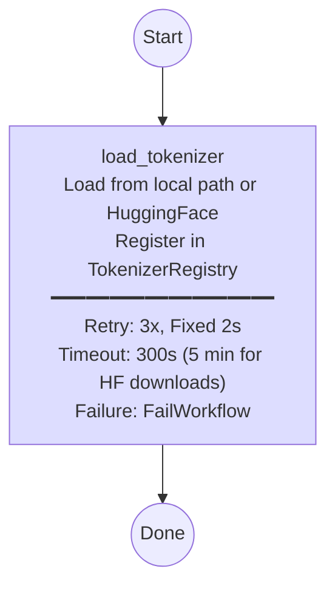
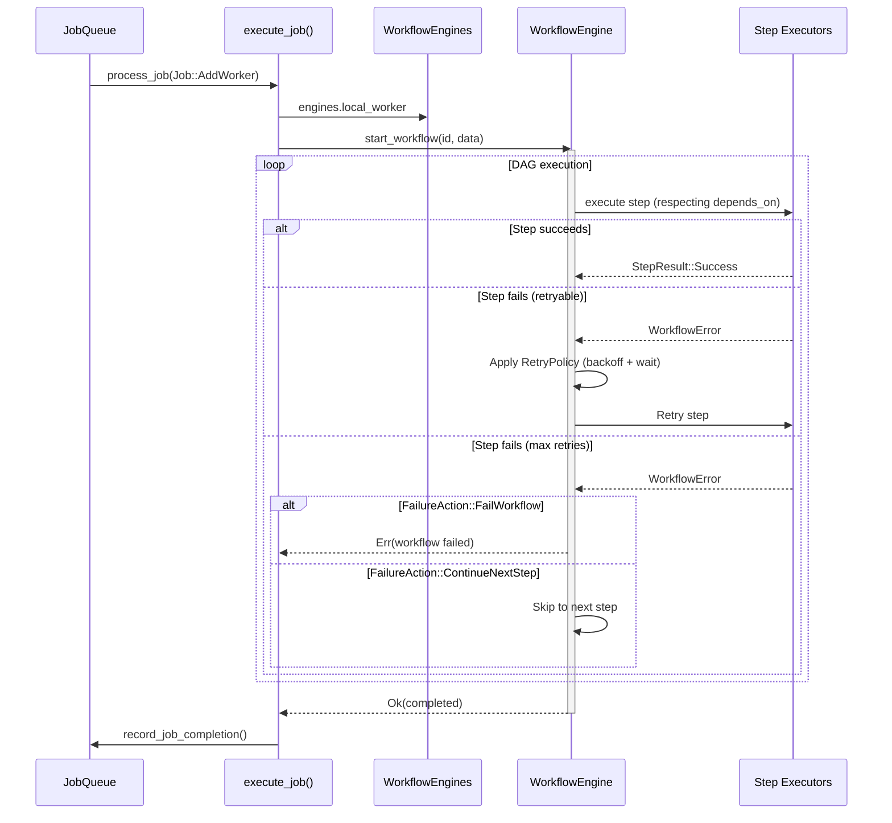

# WorkflowEngines Design

Typed workflow engine collection for executing multi-step control plane operations with retry, timeout, and DAG-based step ordering.

## Architecture Overview



## Engine Types



## Step Configuration

Each step in a workflow can be configured with:



## Local Worker Registration Workflow

The most complex workflow — registers a locally deployed inference engine.



## Worker Removal Workflow



## Worker Update Workflow



## Tokenizer Registration Workflow



## Integration with JobQueue



## WorkerRegistrationData Trait

Shared steps (register, activate, update_policies) work with any workflow data via this trait:

```mermaid
classDiagram
    class WorkerRegistrationData {
        <<trait>>
        +get_app_context() Option~Arc~AppContext~~
        +get_actual_workers() Option~Vec~Arc~dyn Worker~~~
        +get_labels() Option~HashMap~String, String~~
    }

    class LocalWorkerWorkflowData {
        +config: WorkerConfigRequest
        +connection_mode: Option~ConnectionMode~
        +discovered_labels: HashMap
        +dp_info: Option~DpInfo~
        +workers: Option~WorkerList~
        +app_context: Option~Arc~AppContext~~
        +actual_workers: Option~Vec~Arc~dyn Worker~~~
    }

    WorkerRegistrationData <|.. LocalWorkerWorkflowData

    class RegisterWorkersStep {
        +execute(ctx)
    }
    class ActivateWorkersStep {
        +execute(ctx)
    }
    class UpdatePoliciesStep {
        +execute(ctx)
    }

    RegisterWorkersStep ..> WorkerRegistrationData : "impl StepExecutor&lt;D: WorkerRegistrationData&gt;"
    ActivateWorkersStep ..> WorkerRegistrationData
    UpdatePoliciesStep ..> WorkerRegistrationData
```

## Data Flow: Worker Registration End-to-End

```mermaid
graph LR
    subgraph Input
        URL["Worker URL<br/>http://10.0.0.1:8000"]
        CONFIG["WorkerConfigRequest<br/>type, api_key, labels"]
    end

    subgraph "Step 1: Detect"
        PROBE["Probe HTTP + gRPC<br/>Determine protocol"]
        MODE["ConnectionMode::Http<br/>or ConnectionMode::Grpc"]
    end

    subgraph "Step 2: Discover"
        INFO["GET /server_info<br/>or gRPC ServerInfo"]
        LABELS["model_id, max_model_len<br/>runtime_type, etc."]
    end

    subgraph "Step 3: DP Discovery"
        DPCHECK["Check DP rank count<br/>behind single URL"]
        DPINFO["DpInfo: rank_count, urls"]
    end

    subgraph "Step 4: Create"
        BUILD["BasicWorkerBuilder<br/>.url() .model_id()<br/>.connection_mode()<br/>.worker_type()"]
        WORKERS["Vec&lt;Arc&lt;dyn Worker&gt;&gt;<br/>1 per DP rank"]
    end

    subgraph "Step 5: Register + Activate"
        REG["WorkerRegistry.register()"]
        POL["PolicyRegistry.add()"]
        ACT["worker.set_healthy(true)"]
    end

    URL --> PROBE --> MODE
    CONFIG --> PROBE
    MODE --> INFO --> LABELS
    LABELS --> DPCHECK --> DPINFO
    DPINFO --> BUILD --> WORKERS
    WORKERS --> REG
    WORKERS --> POL
    WORKERS --> ACT
```


